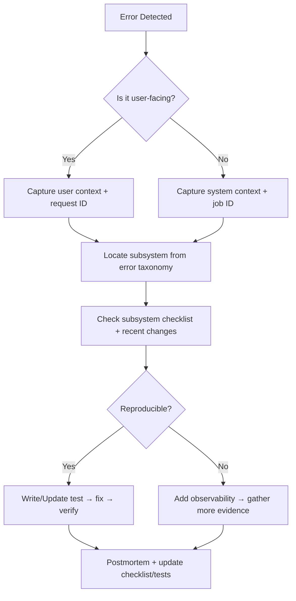

# System-Wide TODO & Traceability Hub

> **Purpose:** Provide a single, system-wide backlog that any agentic system can query to understand build checklists, tests, diagrams, and flowcharts. This hub is the authoritative index for tracing and fixing errors quickly and consistently.

## How to Use This Document

- **All agentic systems** should start here to locate the relevant checklist for a component or workflow.
- **Each checklist item** is written as a testable, verifiable outcome.
- **Traceability** is maintained by linking tests, diagrams, and flowcharts to the system or subsystem.
- **Structure:** Documentation → Coding (MVP) → Tests → Diagrams, to keep specs ahead of implementation.
- **Update rule:** When a feature is added or a workflow changes, update:
  1. The checklist for that subsystem
  2. The related test plan
  3. Any impacted diagram/flowchart
  4. The corresponding documentation draft so it reflects the coded behavior

### Task Card Template (Required for Each Checklist Item)

Use this template under every checklist item to ensure the TODO list is the
authoritative source of truth for what is done, what is blocked, and what is
required to finish.

```
Task Card:
- Status: [ ] / [~] / [x]
- Why not done / Blocker:
- What needs to be completed:
- Done looks like (acceptance criteria):
- Files involved:
- Resources (docs/links/specs):
- Tests required:
- Docs updates required:
- Subtasks (optional):
```

### Next-Task Selection Rules (Agent Priority)

1. **Respect phase order**: pick the earliest phase with open items (Docs → Code → Tests → Diagrams).
2. **Pick smallest actionable** item first: choose tasks with clear acceptance criteria and no blockers.
3. **If blocked**, select a task in the same subsystem that unblocks it (e.g., missing spec → write spec).
4. **After coding**, immediately queue tests and doc updates required by the update rule above.

### Agent Execution Loop (Design → Document → Code → Test → Update)

1. Read `SYSTEM_TODO.md` and identify the subsystem with open items.
2. Pick the next task using the **Next-Task Selection Rules**.
3. Execute the task using the repo workflow (pre-flight → scope → plan → implement → validate → summarize).
4. Update the Task Card with status, blockers, files, resources, tests, and doc updates.
5. Repeat from step 1 until all items in the current phase are complete.

## Global Status Legend

- **[ ]** Not started
- **[~]** In progress
- **[x]** Complete

---

## 1) Creator Operating System (Private)

### 1.1 Narrative Engine

**Documentation**
- [x] Narrative engine API surface documented (events, knowledge, promises)
- [x] Narrative engine endpoint map aligned with API.md
- [x] Canon vs. draft data rules documented (validation + persistence constraints)

**Coding (MVP)**
- [x] Event model implemented with immutable canon transitions
- [x] Dependency DAG validation implemented (acyclic + referential integrity)
- [x] Knowledge state tracking with temporal constraints
- [x] Promise tracking (pending/fulfilled/broken/transformed)
- [x] Canon vs. draft separation enforced at persistence layer
- [x] Canon gate validation pipeline (continuity, promises, listener cognition)

**Tests**
- [x] Unit: event creation, mutation rejection once canon
- [x] Unit: DAG validator (cycle detection, missing nodes)
- [x] Unit: knowledge state propagation rules
- [x] Unit: promise lifecycle transitions
- [ ] Integration: canon gate rejects contradictory changes
- [ ] Integration: draft changes do not leak into canon

**Diagrams**
- [x] Event dependency DAG example (diagram)
- [x] Canon gate decision flow (flowchart)

---

### 1.2 Audio Engine

**Documentation**
- [x] Audio scene schema spec and validation rules documented → [docs/audio_engine_schema.md](./docs/audio_engine_schema.md)
- [x] Voice profile constraints and audio safety guidelines documented → [docs/audio_engine_schema.md](./docs/audio_engine_schema.md)

**Coding (MVP)**
- [ ] Audio Scene Object schema defined and validated
- [ ] Beat marker authoring and validation
- [ ] Voice profile definition + enforcement
- [ ] Recording packet generation with context blocks
- [ ] Listener cognition safeguards pass/fail rules

**Tests**
- [ ] Unit: beat marker insertion + ordering
- [ ] Unit: voice profile constraints
- [ ] Integration: recording packet output completeness
- [ ] Integration: listener confusion audit scoring

**Diagrams**
- [x] Audio scene generation pipeline (flowchart) → [docs/auto_scene_generation_pipeline.md](./docs/auto_scene_generation_pipeline.md)
- [x] Listener confusion audit decision tree (flowchart) → [docs/listener_confusion_audit_decision_tree.md](./docs/listener_confusion_audit_decision_tree.md)

---

### 1.3 MCP Spine

**Documentation**
- [x] MCP service boundaries and contract docs (resources/tools/permissions) → [docs/mcp_service_contracts.md](./docs/mcp_service_contracts.md)
- [x] Proposal schema v1 documented (fields, validation, lifecycle) → [docs/proposal_schema_v1.md](./docs/proposal_schema_v1.md)
- [x] Publish API contract documented (one-way COS → Listener) → [API.md](./API.md)

**Coding (MVP)**
- [x] Define MCP spine service boundary + repo folder structure
- [x] Establish MCP server runtime (Node/TS) + basic bootstrap
- [x] Implement MCP server handshake and version negotiation
- [x] Register core resource catalog (read-only narrative/audio/listener summaries)
- [x] Implement resource resolver layer with access guards
- [x] Define proposal schema (canonical JSON schema + versioning strategy)
- [x] Build proposal lifecycle store (draft → submitted → validated → applied → archived)
- [x] Tool endpoints for proposals only (no direct canon writes)
- [x] Proposal validation pipeline (continuity, dependency DAG, canon gates)
- [x] Scoped permissions enforcement (resource/tool scopes + model roles)
- [x] Model registry with scoped capabilities (Opus/Sonnet/Haiku)
- [x] Proposal audit log + validation report
- [ ] Canon gate integration hook (block apply on failed validation)
- [x] Tool response templates with deterministic metadata (proposal_id, scope, status)
- [ ] MCP prompt templates for common workflows (continuity check, outline, recap)
- [ ] Access token strategy (service-to-service auth, short-lived tokens)
- [ ] Rate limiting + abuse safeguards per model and scope
- [x] Error taxonomy mapping for MCP responses (codes, severity, owner) → [docs/error_taxonomy.md](./docs/error_taxonomy.md)
- [~] Observability hooks (structured logs, trace IDs, audit events)
- [ ] Local dev harness (mock resources + test proposals)
- [ ] MCP Inspector configuration for debugging
- [ ] Deployment config for MCP service (env vars, secrets, health checks)

Task Card: Establish MCP server runtime (Node/TS) + basic bootstrap
- Status: [x]
- Why not done / Blocker:
- What needs to be completed: Start an HTTP server with health check and MCP routing.
- Done looks like (acceptance criteria): Server listens on configured port and serves MCP endpoints.
- Files involved: services/mcp-spine/src/index.ts
- Resources (docs/links/specs): docs/mcp_service_contracts.md
- Tests required: None (runtime scaffold only).
- Docs updates required: SYSTEM_TODO.md updated.
- Subtasks (optional):

Task Card: Implement MCP server handshake and version negotiation
- Status: [x]
- Why not done / Blocker:
- What needs to be completed: Return protocol and catalog versions during handshake.
- Done looks like (acceptance criteria): GET /mcp/handshake returns protocol_version and server_version.
- Files involved: services/mcp-spine/src/index.ts
- Resources (docs/links/specs): docs/mcp_service_contracts.md
- Tests required: None (manual response verification).
- Docs updates required: SYSTEM_TODO.md updated.
- Subtasks (optional):

Task Card: Register core resource catalog (read-only narrative/audio/listener summaries)
- Status: [x]
- Why not done / Blocker:
- What needs to be completed: Add audio and listener summary resources to catalog.
- Done looks like (acceptance criteria): Resource catalog includes narrative, audio, and listener summary entries.
- Files involved: services/mcp-spine/src/resources/resourceCatalog.ts
- Resources (docs/links/specs): docs/mcp_service_contracts.md
- Tests required: None (manual response verification).
- Docs updates required: SYSTEM_TODO.md updated.
- Subtasks (optional):

Task Card: Implement resource resolver layer with access guards
- Status: [x]
- Why not done / Blocker:
- What needs to be completed: Resolve resources only when role/model scopes permit.
- Done looks like (acceptance criteria): Resolver blocks unauthorized access and returns stub data for allowed scopes.
- Files involved: services/mcp-spine/src/resources/resourceResolver.ts, services/mcp-spine/src/scopes/scopeUtils.ts, services/mcp-spine/src/models/modelRegistry.ts
- Resources (docs/links/specs): docs/mcp_service_contracts.md
- Tests required: None (manual response verification).
- Docs updates required: SYSTEM_TODO.md updated.
- Subtasks (optional):

Task Card: Define proposal schema (canonical JSON schema + versioning strategy)
- Status: [x]
- Why not done / Blocker:
- What needs to be completed: Add a schema registry to support version negotiation.
- Done looks like (acceptance criteria): Schema registry exports v1 and documents the version key.
- Files involved: services/mcp-spine/src/proposals/proposalSchemaV1.ts, services/mcp-spine/src/proposals/schemaRegistry.ts
- Resources (docs/links/specs): docs/proposal_schema_v1.md
- Tests required: None (schema registry only).
- Docs updates required: SYSTEM_TODO.md updated.
- Subtasks (optional):

Task Card: Build proposal lifecycle store (draft → submitted → validated → applied → archived)
- Status: [x]
- Why not done / Blocker:
- What needs to be completed: Create an in-memory store to track proposal state transitions.
- Done looks like (acceptance criteria): Store creates proposals and updates status + validation payloads.
- Files involved: services/mcp-spine/src/proposals/proposalStore.ts, services/mcp-spine/src/proposals/proposalTypes.ts
- Resources (docs/links/specs): docs/proposal_schema_v1.md
- Tests required: None (manual response verification).
- Docs updates required: SYSTEM_TODO.md updated.
- Subtasks (optional):

Task Card: Tool endpoints for proposals only (no direct canon writes)
- Status: [x]
- Why not done / Blocker:
- What needs to be completed: Add proposal tool endpoint with scope authorization.
- Done looks like (acceptance criteria): POST /mcp/tools/proposals creates proposals and returns metadata.
- Files involved: services/mcp-spine/src/index.ts, services/mcp-spine/src/tools/proposalTool.ts
- Resources (docs/links/specs): docs/mcp_service_contracts.md
- Tests required: None (manual response verification).
- Docs updates required: SYSTEM_TODO.md updated.
- Subtasks (optional):

Task Card: Proposal validation pipeline (continuity, dependency DAG, canon gates)
- Status: [x]
- Why not done / Blocker:
- What needs to be completed: Add placeholder validation rules for canon events and dependencies.
- Done looks like (acceptance criteria): Pipeline returns passed/failed status with warnings and errors.
- Files involved: services/mcp-spine/src/proposals/validationPipeline.ts
- Resources (docs/links/specs): docs/proposal_schema_v1.md, docs/narrative_engine_diagrams.md
- Tests required: None (manual response verification).
- Docs updates required: SYSTEM_TODO.md updated.
- Subtasks (optional):

Task Card: Model registry with scoped capabilities (Opus/Sonnet/Haiku)
- Status: [x]
- Why not done / Blocker:
- What needs to be completed: Add registry entries with scope mappings per model.
- Done looks like (acceptance criteria): Model registry resolves scope sets for Opus/Sonnet/Haiku.
- Files involved: services/mcp-spine/src/models/modelRegistry.ts, services/mcp-spine/src/scopes/scopeMap.ts
- Resources (docs/links/specs): docs/mcp_permissions_scope_map.md
- Tests required: None (manual response verification).
- Docs updates required: SYSTEM_TODO.md updated.
- Subtasks (optional):

Task Card: Proposal audit log + validation report
- Status: [x]
- Why not done / Blocker:
- What needs to be completed: Emit logs when proposals are created and validated.
- Done looks like (acceptance criteria): Logger records proposal_id and validation status events.
- Files involved: services/mcp-spine/src/tools/proposalTool.ts, services/mcp-spine/src/logger.ts
- Resources (docs/links/specs): docs/error_taxonomy.md
- Tests required: None (manual response verification).
- Docs updates required: SYSTEM_TODO.md updated.
- Subtasks (optional):

Task Card: Tool response templates with deterministic metadata (proposal_id, scope, status)
- Status: [x]
- Why not done / Blocker:
- What needs to be completed: Return deterministic metadata from proposal tool responses.
- Done looks like (acceptance criteria): Proposal tool response includes proposal_id, scope, status, and timestamps.
- Files involved: services/mcp-spine/src/tools/proposalTool.ts
- Resources (docs/links/specs): docs/mcp_service_contracts.md
- Tests required: None (manual response verification).
- Docs updates required: SYSTEM_TODO.md updated.
- Subtasks (optional):

**Tests**
- [ ] Unit: scope authorization checks
- [ ] Unit: proposal schema validation (happy + failure modes)
- [ ] Unit: resource resolver access guards
- [ ] Unit: tool response metadata consistency
- [ ] Integration: proposal workflow end-to-end (create → validate → apply)
- [ ] Integration: forbidden scope access rejection
- [ ] Integration: canon gate rejects invalid proposals
- [ ] Integration: audit log written on proposal lifecycle transitions
- [ ] Integration: rate limit enforcement and error response mapping

**Diagrams**
- [x] Proposal-based modification flow (flowchart) → [docs/proposal_modification_flow.md](./docs/proposal_modification_flow.md)
  Task Card:
  - Status: [x]
  - Why not done / Blocker:
  - What needs to be completed: Document proposal flow with canon gate outcomes and audit logging.
  - Done looks like (acceptance criteria): Flow includes schema validation, canon gate pass/fail, and audit log.
  - Files involved: docs/proposal_modification_flow.md
  - Resources (docs/links/specs): docs/mcp_service_contracts.md, docs/proposal_schema_v1.md
  - Tests required: None (documentation diagram only).
  - Docs updates required: docs/proposal_modification_flow.md updated from draft.
  - Subtasks (optional):
- [x] MCP permissions scope map (diagram) → [docs/mcp_permissions_scope_map.md](./docs/mcp_permissions_scope_map.md)
  Task Card:
  - Status: [x]
  - Why not done / Blocker:
  - What needs to be completed: Define scopes, access matrix, and model scope mapping.
  - Done looks like (acceptance criteria): Matrix and diagram show role-to-scope relationships and model scopes.
  - Files involved: docs/mcp_permissions_scope_map.md
  - Resources (docs/links/specs): docs/mcp_service_contracts.md, docs/proposal_schema_v1.md
  - Tests required: None (documentation diagram only).
  - Docs updates required: docs/mcp_permissions_scope_map.md updated from draft.
  - Subtasks (optional):
- [x] MCP request lifecycle sequence (diagram) → [docs/mcp_request_lifecycle_sequence.md](./docs/mcp_request_lifecycle_sequence.md)
  Task Card:
  - Status: [x]
  - Why not done / Blocker:
  - What needs to be completed: Document request flow including routing, metadata, and audit logging.
  - Done looks like (acceptance criteria): Sequence includes routing step and explicit response metadata list.
  - Files involved: docs/mcp_request_lifecycle_sequence.md
  - Resources (docs/links/specs): docs/mcp_service_contracts.md, docs/error_taxonomy.md
  - Tests required: None (documentation diagram only).
  - Docs updates required: docs/mcp_request_lifecycle_sequence.md updated from draft.
  - Subtasks (optional):
- [x] MCP spine architecture block diagram (diagram) → [docs/mcp_spine_architecture_block_diagram.md](./docs/mcp_spine_architecture_block_diagram.md)
  Task Card:
  - Status: [x]
  - Why not done / Blocker:
  - What needs to be completed: Finalize MCP spine block diagram with routing, auth, resource, and proposal flow.
  - Done looks like (acceptance criteria): Diagram shows gateway, scope guard, model routing, resource resolver, proposal flow, and audit trail.
  - Files involved: docs/mcp_spine_architecture_block_diagram.md
  - Resources (docs/links/specs): docs/mcp_service_contracts.md, docs/proposal_schema_v1.md, docs/error_taxonomy.md
  - Tests required: None (documentation diagram only).
  - Docs updates required: docs/mcp_spine_architecture_block_diagram.md finalized.
  - Subtasks (optional):

**Initial Setup Steps (Start Here)**
1. [x] Confirm MCP server runtime choice and initialize service scaffold
2. [x] Define resource catalog MVP (events, canon, knowledge snapshots)
3. [x] Draft proposal JSON schema v1 + validation rules
4. [x] Implement scope map v1 (roles → resources/tools)
5. [x] Wire basic proposal tool endpoint returning proposal_id
6. [x] Stub validation pipeline with placeholder checks + audit log

---

## 2) Listener Platform (Public)

### 2.1 Marketing & Onboarding

**Documentation**
- [x] Marketing funnel steps documented (landing → signup → checkout) → [docs/marketing_onboarding.md](./docs/marketing_onboarding.md)
- [x] Onboarding content checklist documented (email copy + FAQ) → [docs/marketing_onboarding.md](./docs/marketing_onboarding.md)

**Coding (MVP)**
- [ ] Landing page with audio trailer
- [ ] Founders pricing and CTA flow
- [ ] Email auth onboarding (Replit or Supabase)

**Tests**
- [ ] E2E: marketing → signup → checkout
- [ ] Accessibility checks (contrast, focus, keyboard nav)

**Diagrams**
- [x] Visitor conversion funnel (flowchart) → [docs/visitor_conversion_funnel.md](./docs/visitor_conversion_funnel.md)

---

### 2.2 Payments & Entitlements

**Documentation**
- [x] Payment and entitlement rules documented (tiers, access windows) → [docs/payments_entitlements.md](./docs/payments_entitlements.md)
- [x] Webhook event matrix documented (Stripe event → handler action) → [docs/payments_entitlements.md](./docs/payments_entitlements.md)

**Coding (MVP)**
- [ ] Stripe Checkout integration
- [ ] Webhook verification + idempotency
- [ ] Entitlement grant + verification API

**Tests**
- [ ] Integration: webhook signature validation
- [ ] Integration: entitlement grant and retrieval
- [ ] E2E: successful payment unlocks library access

**Diagrams**
- [x] Payment → entitlement flow (flowchart) → [docs/payment_entitlement_flow.md](./docs/payment_entitlement_flow.md)

---

### 2.3 Audiobook Player & Library

**Documentation**
- [x] Player UX flows documented (library → player → resume) → [docs/player_ux_flows.md](./docs/player_ux_flows.md)
- [x] Signed URL access rules documented (expiry, scopes) → [docs/signed_url_access_rules.md](./docs/signed_url_access_rules.md)
- [x] Library and playback API endpoints documented → [API.md](./API.md)

**Coding (MVP)**
- [x] Library page lists available chapters
- [x] Player supports streaming + resume
- [x] Signed URL generation for audio access
- [x] Playback position persistence

**Tests**
- [x] Unit: signed URL generation input validation
- [x] Integration: playback position save + restore
- [x] E2E: play, pause, resume, continue across session

**Diagrams**
- [x] Audio streaming access flow (flowchart) → [docs/audio_streaming_access_flow.md](./docs/audio_streaming_access_flow.md)

---

## 3) Data Layer

### 3.1 Narrative DB

**Documentation**
- [x] Narrative DB schema documented (events, knowledge, promises) → [docs/narrative_db_documentation.md](./docs/narrative_db_documentation.md)
- [x] Canon/draft enforcement rules documented (constraints + triggers) → [docs/canon_draft_enforcement.md](./docs/canon_draft_enforcement.md)

**Coding (MVP)**
- [ ] Schema migrations for events, knowledge states, promises
- [ ] Referential integrity constraints
- [ ] Canon/draft separation enforcement

**Tests**
- [ ] Migration tests
- [ ] Data integrity checks (foreign keys, enums)

**Diagrams**
- [x] Narrative schema ERD → [docs/narrative_schema_erd.md](./docs/narrative_schema_erd.md)

---

### 3.2 Audio Storage

**Documentation**
- [x] Storage paths and metadata conventions documented → [docs/audio_storage_conventions.md](./docs/audio_storage_conventions.md)
- [x] CDN cache strategy documented (TTL, purge rules) → [docs/audio_storage_conventions.md](./docs/audio_storage_conventions.md)

**Coding (MVP)**
- [x] Object storage paths and metadata conventions
- [x] CDN distribution and cache strategy

**Tests**
- [x] Integration: audio upload + retrieval
- [x] Integration: signed URL expiry enforcement

**Diagrams**
- [x] Storage → CDN delivery flow

---

### 3.3 Listener DB

**Documentation**
- [x] Listener schema documented (users, entitlements, playback) → [docs/listener_db_documentation.md](./docs/listener_db_documentation.md)
- [x] Data retention and deletion policy documented → [docs/listener_db_documentation.md](./docs/listener_db_documentation.md)

**Coding (MVP)**
- [ ] User accounts, entitlements, playback positions schema
- [ ] Data retention and deletion workflow

**Tests**
- [ ] Migration tests
- [ ] Integration: playback position updates and retrieval

**Diagrams**
- [x] Listener schema ERD → [docs/listener_schema_erd.md](./docs/listener_schema_erd.md)
  Task Card:
  - Status: [x]
  - Why not done / Blocker:
  - What needs to be completed: Provide ERD for users, entitlements, and playback positions with field detail.
  - Done looks like (acceptance criteria): Mermaid ERD reflects documented tables and relationships.
  - Files involved: docs/listener_schema_erd.md
  - Resources (docs/links/specs): docs/listener_db_documentation.md, docs/payments_entitlements.md
  - Tests required: None (documentation diagram only).
  - Docs updates required: docs/listener_schema_erd.md finalized.
  - Subtasks (optional):

---

## 4) Observability, Errors, and Incident Tracing

### 4.1 Global Error Trace Checklist

- [x] Unified error taxonomy (codes, severity, owner) → [docs/error_taxonomy.md](./docs/error_taxonomy.md)
- [x] Log correlation IDs across services → [docs/observability_logging_alerting.md](./docs/observability_logging_alerting.md)
- [x] Structured logging format (JSON) → [docs/observability_logging_alerting.md](./docs/observability_logging_alerting.md)
- [x] Alerting rules for critical failures → [docs/observability_logging_alerting.md](./docs/observability_logging_alerting.md)
- [x] Error playbooks for each subsystem → [docs/error_playbooks.md](./docs/error_playbooks.md)

### 4.2 Incident Flowchart


Reference diagram: [docs/incident_response_flow.md](./docs/incident_response_flow.md)

### 4.3 Error Traceability Matrix

| Subsystem | Primary Logs | Correlation Keys | First-Line Tests |
|-----------|---------------|------------------|------------------|
| Narrative Engine | narrative-service | event_id, proposal_id | DAG validator, canon gate tests |
| Audio Engine | audio-service | scene_id, packet_id | packet generation tests |
| MCP Spine | mcp-service | proposal_id, tool_name | scope authorization tests |
| Listener Platform | web-app | user_id, session_id | auth + playback E2E |
| Payments | payments-service | stripe_event_id, user_id | webhook validation |

---

## 5) Diagrams & Flowcharts Inventory

**Required Diagrams (index)**
- [x] System architecture overview (high-level)
- [x] Narrative event DAG example → [docs/narrative_engine_diagrams.md](./docs/narrative_engine_diagrams.md)
- [x] Canon gate decision flow → [docs/narrative_engine_diagrams.md](./docs/narrative_engine_diagrams.md)
- [x] Audio scene generation pipeline → [docs/auto_scene_generation_pipeline.md](./docs/auto_scene_generation_pipeline.md)
- [x] Listener confusion audit decision tree → [docs/listener_confusion_audit_decision_tree.md](./docs/listener_confusion_audit_decision_tree.md)
- [x] Proposal-based modification flow → [docs/proposal_modification_flow.md](./docs/proposal_modification_flow.md)
- [x] MCP permissions scope map → [docs/mcp_permissions_scope_map.md](./docs/mcp_permissions_scope_map.md)
- [x] MCP request lifecycle sequence → [docs/mcp_request_lifecycle_sequence.md](./docs/mcp_request_lifecycle_sequence.md)
- [x] MCP spine architecture block diagram → [docs/mcp_spine_architecture_block_diagram.md](./docs/mcp_spine_architecture_block_diagram.md)
- [x] Visitor conversion funnel → [docs/visitor_conversion_funnel.md](./docs/visitor_conversion_funnel.md)
- [x] Payment → entitlement flow → [docs/payment_entitlement_flow.md](./docs/payment_entitlement_flow.md)
- [x] Audio streaming access flow → [docs/audio_streaming_access_flow.md](./docs/audio_streaming_access_flow.md)
- [x] Storage → CDN delivery flow
- [x] Incident response flow (see above) → [docs/incident_response_flow.md](./docs/incident_response_flow.md)
- [x] Narrative schema ERD → [docs/narrative_schema_erd.md](./docs/narrative_schema_erd.md)
- [x] Listener schema ERD → [docs/listener_schema_erd.md](./docs/listener_schema_erd.md)

---

## 6) Documentation Sync Checklist

When updating this system-wide list, update references in:
- [x] README.md (Documentation section)
- [x] CLAUDE.md (AI assistant entry points)
- [x] ARCHITECTURE.md (roadmap + cross-links)
- [x] TESTING_STRATEGY.md (test backlog alignment)

---

## 7) Near-Term Priority Queue

1. [ ] Create system diagrams listed in Section 5
2. [x] Define unified error taxonomy + severity table → [docs/error_taxonomy.md](./docs/error_taxonomy.md)
3. [x] Draft subsystem playbooks for Narrative, Audio, MCP, Listener Platform
4. [ ] Align tests with build checklists for Phase 1 deliverables
5. [ ] Add instrumentation standards (log fields, trace IDs)
6. [ ] Begin MVP coding passes for each subsystem (Narrative, Audio, MCP, Listener, Data Layer)
