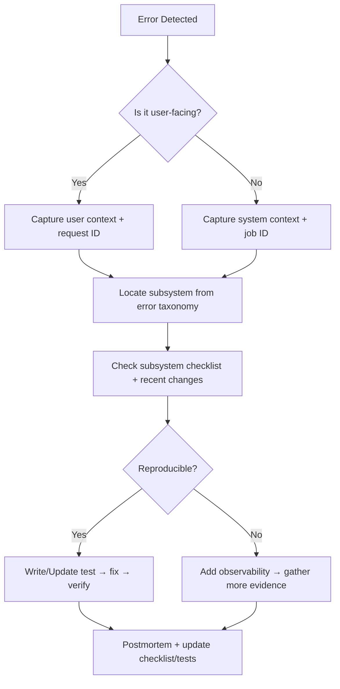

# System-Wide TODO & Traceability Hub

> **Purpose:** Provide a single, system-wide backlog that any agentic system can query to understand build checklists, tests, diagrams, and flowcharts. This hub is the authoritative index for tracing and fixing errors quickly and consistently.

## How to Use This Document

- **All agentic systems** should start here to locate the relevant checklist for a component or workflow.
- **Each checklist item** is written as a testable, verifiable outcome.
- **Traceability** is maintained by linking tests, diagrams, and flowcharts to the system or subsystem.
- **Structure:** Documentation → Coding (MVP) → Tests → Diagrams, to keep specs ahead of implementation.
- **Update rule:** When a feature is added or a workflow changes, update:
  1. The checklist for that subsystem
  2. The related test plan
  3. Any impacted diagram/flowchart

## Global Status Legend

- **[ ]** Not started
- **[~]** In progress
- **[x]** Complete

---

## 1) Creator Operating System (Private)

### 1.1 Narrative Engine

**Documentation**
- [x] Narrative engine API surface documented (events, knowledge, promises)
- [x] Narrative engine endpoint map aligned with API.md
- [x] Canon vs. draft data rules documented (validation + persistence constraints)

**Coding (MVP)**
- [x] Event model implemented with immutable canon transitions
- [x] Dependency DAG validation implemented (acyclic + referential integrity)
- [x] Knowledge state tracking with temporal constraints
- [x] Promise tracking (pending/fulfilled/broken/transformed)
- [x] Canon vs. draft separation enforced at persistence layer
- [x] Canon gate validation pipeline (continuity, promises, listener cognition)

**Tests**
- [x] Unit: event creation, mutation rejection once canon
- [x] Unit: DAG validator (cycle detection, missing nodes)
- [x] Unit: knowledge state propagation rules
- [x] Unit: promise lifecycle transitions
- [ ] Integration: canon gate rejects contradictory changes
- [ ] Integration: draft changes do not leak into canon

**Diagrams**
- [x] Event dependency DAG example (diagram)
- [x] Canon gate decision flow (flowchart)

---

### 1.2 Audio Engine

**Documentation**
- [x] Audio scene schema spec and validation rules documented → [docs/audio_engine_schema.md](./docs/audio_engine_schema.md)
- [x] Voice profile constraints and audio safety guidelines documented → [docs/audio_engine_schema.md](./docs/audio_engine_schema.md)

**Coding (MVP)**
- [ ] Audio Scene Object schema defined and validated
- [ ] Beat marker authoring and validation
- [ ] Voice profile definition + enforcement
- [ ] Recording packet generation with context blocks
- [ ] Listener cognition safeguards pass/fail rules

**Tests**
- [ ] Unit: beat marker insertion + ordering
- [ ] Unit: voice profile constraints
- [ ] Integration: recording packet output completeness
- [ ] Integration: listener confusion audit scoring

**Diagrams**
- [x] Audio scene generation pipeline (flowchart) → [docs/auto_scene_generation_pipeline.md](./docs/auto_scene_generation_pipeline.md)
- [x] Listener confusion audit decision tree (flowchart) → [docs/listener_confusion_audit_decision_tree.md](./docs/listener_confusion_audit_decision_tree.md)

---

### 1.3 MCP Spine

**Documentation**
- [ ] MCP service boundaries and contract docs (resources/tools/permissions)
- [ ] Proposal schema v1 documented (fields, validation, lifecycle)
- [x] Publish API contract documented (one-way COS → Listener) → [API.md](./API.md)

**Coding (MVP)**
- [x] Define MCP spine service boundary + repo folder structure
- [~] Establish MCP server runtime (Node/TS) + basic bootstrap
- [ ] Implement MCP server handshake and version negotiation
- [ ] Register core resource catalog (read-only narrative/audio/listener summaries)
- [ ] Implement resource resolver layer with access guards
- [ ] Define proposal schema (canonical JSON schema + versioning strategy)
- [ ] Build proposal lifecycle store (draft → submitted → validated → applied → archived)
- [ ] Tool endpoints for proposals only (no direct canon writes)
- [ ] Proposal validation pipeline (continuity, dependency DAG, canon gates)
- [x] Scoped permissions enforcement (resource/tool scopes + model roles)
- [ ] Model registry with scoped capabilities (Opus/Sonnet/Haiku)
- [ ] Proposal audit log + validation report
- [ ] Canon gate integration hook (block apply on failed validation)
- [ ] Tool response templates with deterministic metadata (proposal_id, scope, status)
- [ ] MCP prompt templates for common workflows (continuity check, outline, recap)
- [ ] Access token strategy (service-to-service auth, short-lived tokens)
- [ ] Rate limiting + abuse safeguards per model and scope
- [x] Error taxonomy mapping for MCP responses (codes, severity, owner) → [docs/error_taxonomy.md](./docs/error_taxonomy.md)
- [~] Observability hooks (structured logs, trace IDs, audit events)
- [ ] Local dev harness (mock resources + test proposals)
- [ ] MCP Inspector configuration for debugging
- [ ] Deployment config for MCP service (env vars, secrets, health checks)

**Tests**
- [ ] Unit: scope authorization checks
- [ ] Unit: proposal schema validation (happy + failure modes)
- [ ] Unit: resource resolver access guards
- [ ] Unit: tool response metadata consistency
- [ ] Integration: proposal workflow end-to-end (create → validate → apply)
- [ ] Integration: forbidden scope access rejection
- [ ] Integration: canon gate rejects invalid proposals
- [ ] Integration: audit log written on proposal lifecycle transitions
- [ ] Integration: rate limit enforcement and error response mapping

**Diagrams**
- [ ] Proposal-based modification flow (flowchart)
- [ ] MCP permissions scope map (diagram)
- [ ] MCP request lifecycle sequence (diagram)
- [ ] MCP spine architecture block diagram (diagram)

**Initial Setup Steps (Start Here)**
1. [x] Confirm MCP server runtime choice and initialize service scaffold
2. [ ] Define resource catalog MVP (events, canon, knowledge snapshots)
3. [ ] Draft proposal JSON schema v1 + validation rules
4. [ ] Implement scope map v1 (roles → resources/tools)
5. [ ] Wire basic proposal tool endpoint returning proposal_id
6. [ ] Stub validation pipeline with placeholder checks + audit log

---

## 2) Listener Platform (Public)

### 2.1 Marketing & Onboarding

**Documentation**
- [x] Marketing funnel steps documented (landing → signup → checkout) → [docs/marketing_onboarding.md](./docs/marketing_onboarding.md)
- [x] Onboarding content checklist documented (email copy + FAQ) → [docs/marketing_onboarding.md](./docs/marketing_onboarding.md)

**Coding (MVP)**
- [ ] Landing page with audio trailer
- [ ] Founders pricing and CTA flow
- [ ] Email auth onboarding (Replit or Supabase)

**Tests**
- [ ] E2E: marketing → signup → checkout
- [ ] Accessibility checks (contrast, focus, keyboard nav)

**Diagrams**
- [ ] Visitor conversion funnel (flowchart)

---

### 2.2 Payments & Entitlements

**Documentation**
- [x] Payment and entitlement rules documented (tiers, access windows) → [docs/payments_entitlements.md](./docs/payments_entitlements.md)
- [x] Webhook event matrix documented (Stripe event → handler action) → [docs/payments_entitlements.md](./docs/payments_entitlements.md)

**Coding (MVP)**
- [ ] Stripe Checkout integration
- [ ] Webhook verification + idempotency
- [ ] Entitlement grant + verification API

**Tests**
- [ ] Integration: webhook signature validation
- [ ] Integration: entitlement grant and retrieval
- [ ] E2E: successful payment unlocks library access

**Diagrams**
- [ ] Payment → entitlement flow (flowchart)

---

### 2.3 Audiobook Player & Library

**Documentation**
- [ ] Player UX flows documented (library → player → resume)
- [ ] Signed URL access rules documented (expiry, scopes)
- [x] Library and playback API endpoints documented → [API.md](./API.md)

**Coding (MVP)**
- [x] Library page lists available chapters
- [x] Player supports streaming + resume
- [x] Signed URL generation for audio access
- [x] Playback position persistence

**Tests**
- [x] Unit: signed URL generation input validation
- [x] Integration: playback position save + restore
- [x] E2E: play, pause, resume, continue across session

**Diagrams**
- [x] Audio streaming access flow (flowchart) → [docs/audio_streaming_access_flow.md](./docs/audio_streaming_access_flow.md)

---

## 3) Data Layer

### 3.1 Narrative DB

**Documentation**
- [x] Narrative DB schema documented (events, knowledge, promises) → [docs/narrative_db_documentation.md](./docs/narrative_db_documentation.md)
- [x] Canon/draft enforcement rules documented (constraints + triggers) → [docs/canon_draft_enforcement.md](./docs/canon_draft_enforcement.md)

**Coding (MVP)**
- [ ] Schema migrations for events, knowledge states, promises
- [ ] Referential integrity constraints
- [ ] Canon/draft separation enforcement

**Tests**
- [ ] Migration tests
- [ ] Data integrity checks (foreign keys, enums)

**Diagrams**
- [ ] Narrative schema ERD

---

### 3.2 Audio Storage

**Documentation**
- [x] Storage paths and metadata conventions documented → [docs/audio_storage_conventions.md](./docs/audio_storage_conventions.md)
- [x] CDN cache strategy documented (TTL, purge rules) → [docs/audio_storage_conventions.md](./docs/audio_storage_conventions.md)

**Coding (MVP)**
- [x] Object storage paths and metadata conventions
- [x] CDN distribution and cache strategy

**Tests**
- [x] Integration: audio upload + retrieval
- [x] Integration: signed URL expiry enforcement

**Diagrams**
- [x] Storage → CDN delivery flow

---

### 3.3 Listener DB

**Documentation**
- [x] Listener schema documented (users, entitlements, playback) → [docs/listener_db_documentation.md](./docs/listener_db_documentation.md)
- [x] Data retention and deletion policy documented → [docs/listener_db_documentation.md](./docs/listener_db_documentation.md)

**Coding (MVP)**
- [ ] User accounts, entitlements, playback positions schema
- [ ] Data retention and deletion workflow

**Tests**
- [ ] Migration tests
- [ ] Integration: playback position updates and retrieval

**Diagrams**
- [ ] Listener schema ERD

---

## 4) Observability, Errors, and Incident Tracing

### 4.1 Global Error Trace Checklist

- [x] Unified error taxonomy (codes, severity, owner) → [docs/error_taxonomy.md](./docs/error_taxonomy.md)
- [ ] Log correlation IDs across services
- [ ] Structured logging format (JSON)
- [ ] Alerting rules for critical failures
- [x] Error playbooks for each subsystem → [docs/error_playbooks.md](./docs/error_playbooks.md)

### 4.2 Incident Flowchart

Reference diagram: [docs/incident_response_flow.md](./docs/incident_response_flow.md)

### 4.3 Error Traceability Matrix

| Subsystem | Primary Logs | Correlation Keys | First-Line Tests |
|-----------|---------------|------------------|------------------|
| Narrative Engine | narrative-service | event_id, proposal_id | DAG validator, canon gate tests |
| Audio Engine | audio-service | scene_id, packet_id | packet generation tests |
| MCP Spine | mcp-service | proposal_id, tool_name | scope authorization tests |
| Listener Platform | web-app | user_id, session_id | auth + playback E2E |
| Payments | payments-service | stripe_event_id, user_id | webhook validation |

---

## 5) Diagrams & Flowcharts Inventory

**Required Diagrams (index)**
- [x] System architecture overview (high-level)
- [x] Narrative event DAG example → [docs/narrative_engine_diagrams.md](./docs/narrative_engine_diagrams.md)
- [x] Canon gate decision flow → [docs/narrative_engine_diagrams.md](./docs/narrative_engine_diagrams.md)
- [x] Audio scene generation pipeline → [docs/auto_scene_generation_pipeline.md](./docs/auto_scene_generation_pipeline.md)
- [x] Listener confusion audit decision tree → [docs/listener_confusion_audit_decision_tree.md](./docs/listener_confusion_audit_decision_tree.md)
- [ ] Payment → entitlement flow
- [x] Audio streaming access flow → [docs/audio_streaming_access_flow.md](./docs/audio_streaming_access_flow.md)
- [x] Storage → CDN delivery flow
- [x] Incident response flow (see above) → [docs/incident_response_flow.md](./docs/incident_response_flow.md)

---

## 6) Documentation Sync Checklist

When updating this system-wide list, update references in:
- [x] README.md (Documentation section)
- [x] CLAUDE.md (AI assistant entry points)
- [x] ARCHITECTURE.md (roadmap + cross-links)
- [x] TESTING_STRATEGY.md (test backlog alignment)

---

## 7) Near-Term Priority Queue

1. [ ] Create system diagrams listed in Section 5
2. [x] Define unified error taxonomy + severity table → [docs/error_taxonomy.md](./docs/error_taxonomy.md)
3. [ ] Draft subsystem playbooks for Narrative, Audio, MCP, Listener Platform
4. [ ] Align tests with build checklists for Phase 1 deliverables
5. [ ] Add instrumentation standards (log fields, trace IDs)
6. [ ] Begin MVP coding passes for each subsystem (Narrative, Audio, MCP, Listener, Data Layer)
