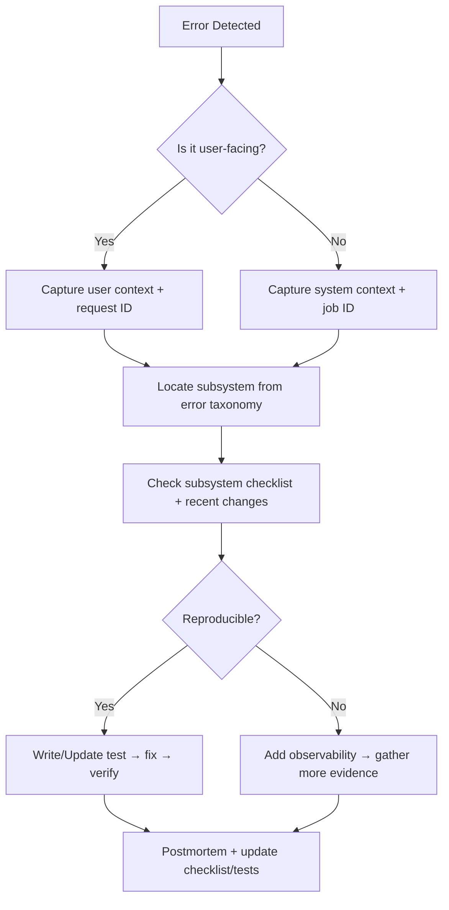

# System-Wide TODO & Traceability Hub

> **Purpose:** Provide a single, system-wide backlog that any agentic system can query to understand build checklists, tests, diagrams, and flowcharts. This hub is the authoritative index for tracing and fixing errors quickly and consistently.

## How to Use This Document

- **All agentic systems** should start here to locate the relevant checklist for a component or workflow.
- **Each checklist item** is written as a testable, verifiable outcome.
- **Traceability** is maintained by linking tests, diagrams, and flowcharts to the system or subsystem.
- **Structure:** Documentation → Coding (MVP) → Tests → Diagrams, to keep specs ahead of implementation.
- **Update rule:** When a feature is added or a workflow changes, update:
  1. The checklist for that subsystem
  2. The related test plan
  3. Any impacted diagram/flowchart
  4. The corresponding documentation draft so it reflects the coded behavior

### Task Card Template (Required for Each Checklist Item)

Use this template under every checklist item to ensure the TODO list is the
authoritative source of truth for what is done, what is blocked, and what is
required to finish.

```
Task Card:
- Status: [ ] / [~] / [x]
- Assignee:
- Claim token:
- Claimed at:
- Why not done / Blocker:
- What needs to be completed:
- Done looks like (acceptance criteria):
- Files involved:
- Resources (docs/links/specs):
- Tests required:
- Docs updates required:
- Subtasks (optional):
```

### Parallel Agent Coordination (Non-Overlapping Work)

- **Claim before work:** No agent starts work until the Task Card shows `Status: [~]` plus assignee + claim token.
- **Single task per agent:** Only one in-progress task at a time per agent.
- **First claim wins:** If two agents overlap, the earliest claim token keeps the task.
- **Unclaim if blocked:** Reset to `Status: [ ]` with a blocker note and move on.
- **Handoff on completion:** Always update acceptance criteria, files, tests, and docs fields so the next agent can pick up cleanly.

### Next-Task Selection Rules (Agent Priority)

1. **Respect phase order**: pick the earliest phase with open items (Docs → Code → Tests → Diagrams).
2. **Pick smallest actionable** item first: choose tasks with clear acceptance criteria and no blockers.
3. **If blocked**, select a task in the same subsystem that unblocks it (e.g., missing spec → write spec).
4. **After coding**, immediately queue tests and doc updates required by the update rule above.

### Agent Execution Loop (Design → Document → Code → Test → Update)

1. Read `SYSTEM_TODO.md` and identify the subsystem with open items.
2. Pick the next task using the **Next-Task Selection Rules**.
3. Execute the task using the repo workflow (pre-flight → scope → plan → implement → validate → summarize).
4. Update the Task Card with status, blockers, files, resources, tests, and doc updates.
5. Repeat from step 1 until all items in the current phase are complete.

## Global Status Legend

- **[ ]** Not started
- **[~]** In progress
- **[x]** Complete

---

## 1) Creator Operating System (Private)

### 1.1 Narrative Engine

**Documentation**
- [x] Narrative engine API surface documented (events, knowledge, promises)
- [x] Narrative engine endpoint map aligned with API.md
- [x] Canon vs. draft data rules documented (validation + persistence constraints)

**Coding (MVP)**
- [x] Event model implemented with immutable canon transitions
- [x] Dependency DAG validation implemented (acyclic + referential integrity)
- [x] Knowledge state tracking with temporal constraints
- [x] Promise tracking (pending/fulfilled/broken/transformed)
- [x] Canon vs. draft separation enforced at persistence layer
- [x] Canon gate validation pipeline (continuity, promises, listener cognition)

**Tests**
- [x] Unit: event creation, mutation rejection once canon
- [x] Unit: DAG validator (cycle detection, missing nodes)
- [x] Unit: knowledge state propagation rules
- [x] Unit: promise lifecycle transitions
- [x] Integration: canon gate rejects contradictory changes
- [x] Integration: draft changes do not leak into canon

Task Card: Integration: draft changes do not leak into canon
- Status: [x]
- Assignee: Agent <1>
- Claim token: 2026-01-22T00:34Z/agent-01
- Claimed at: 2026-01-22T00:34Z
- Why not done / Blocker:
- What needs to be completed: Ensure canon gate evaluation ignores unrelated draft events during narrative snapshots or canonization checks.
- Done looks like (acceptance criteria): Canon gate evaluation passes for canon/proposed events even when draft events contain continuity issues, confirmed via integration test.
- Files involved: naos/apps/web/lib/narrative/service.ts, naos/apps/web/lib/narrative/__tests__/service.test.ts
- Resources (docs/links/specs): docs/narrative_engine_api.md, docs/canon_draft_enforcement.md
- Tests required: naos/apps/web/lib/narrative/__tests__/service.test.ts (not run)
- Docs updates required: SYSTEM_TODO.md updated.
- Subtasks (optional):

Task Card: Integration: canon gate rejects contradictory changes
- Status: [x]
- Why not done / Blocker:
- What needs to be completed: Add integration coverage for canon gate failures caused by continuity conflicts.
- Done looks like (acceptance criteria): Canon gate validation fails when events violate dependency timestamp order.
- Files involved: naos/apps/web/lib/narrative/__tests__/engine.test.ts
- Resources (docs/links/specs): docs/narrative_engine_diagrams.md
- Tests required: naos/apps/web/lib/narrative/__tests__/engine.test.ts
- Docs updates required: SYSTEM_TODO.md updated.
- Subtasks (optional):
- Handoff note: Wire this script into a scheduled job (cron) in the deployment environment when the listener DB is connected.

**Diagrams**
- [x] Event dependency DAG example (diagram)
- [x] Canon gate decision flow (flowchart)

---

### 1.2 Audio Engine

**Documentation**
- [x] Audio scene schema spec and validation rules documented → [docs/audio_engine_schema.md](./docs/audio_engine_schema.md)
- [x] Voice profile constraints and audio safety guidelines documented → [docs/audio_engine_schema.md](./docs/audio_engine_schema.md)

**Coding (MVP)**
- [x] Audio Scene Object schema defined and validated
- [x] Beat marker authoring and validation
- [x] Voice profile definition + enforcement
- [x] Recording packet generation with context blocks
- [x] Listener cognition safeguards pass/fail rules

**Tests**
- [x] Unit: beat marker insertion + ordering
- [x] Unit: voice profile constraints
- [x] Integration: recording packet output completeness
- [x] Integration: listener confusion audit scoring

**Diagrams**
- [x] Audio scene generation pipeline (flowchart) → [docs/auto_scene_generation_pipeline.md](./docs/auto_scene_generation_pipeline.md)
- [x] Listener confusion audit decision tree (flowchart) → [docs/listener_confusion_audit_decision_tree.md](./docs/listener_confusion_audit_decision_tree.md)

Task Card: Audio Scene Object schema defined and validated
- Status: [x]
- Why not done / Blocker:
- What needs to be completed: Implement schema definitions and validation for audio scene objects.
- Done looks like (acceptance criteria): Audio scene schema validates required fields and timing constraints.
- Files involved: naos/apps/web/lib/audio-engine/models.ts, naos/apps/web/lib/audio-engine/engine.ts
- Resources (docs/links/specs): docs/audio_engine_schema.md
- Tests required: naos/apps/web/lib/audio-engine/__tests__/engine.test.ts
- Docs updates required: SYSTEM_TODO.md updated.
- Subtasks (optional):

Task Card: Beat marker authoring and validation
- Status: [x]
- Why not done / Blocker:
- What needs to be completed: Normalize beat marker inputs and resolve ordering/conflicts.
- Done looks like (acceptance criteria): Authoring routine orders markers and records overlap conflicts.
- Files involved: naos/apps/web/lib/audio-engine/engine.ts
- Resources (docs/links/specs): docs/audio_engine_schema.md
- Tests required: naos/apps/web/lib/audio-engine/__tests__/engine.test.ts
- Docs updates required: SYSTEM_TODO.md updated.
- Subtasks (optional):

Task Card: Voice profile definition + enforcement
- Status: [x]
- Why not done / Blocker:
- What needs to be completed: Define voice profile schema and validate track-profile alignment.
- Done looks like (acceptance criteria): Voice profile mismatches are detected during validation.
- Files involved: naos/apps/web/lib/audio-engine/models.ts, naos/apps/web/lib/audio-engine/engine.ts
- Resources (docs/links/specs): docs/audio_engine_schema.md
- Tests required: naos/apps/web/lib/audio-engine/__tests__/engine.test.ts
- Docs updates required: SYSTEM_TODO.md updated.
- Subtasks (optional):

Task Card: Recording packet generation with context blocks
- Status: [x]
- Why not done / Blocker:
- What needs to be completed: Assemble recording packets that include tracks and context blocks.
- Done looks like (acceptance criteria): Recording packet includes beat markers, speaker notes, and track scripts.
- Files involved: naos/apps/web/lib/audio-engine/engine.ts
- Resources (docs/links/specs): docs/audio_engine_schema.md
- Tests required: naos/apps/web/lib/audio-engine/__tests__/engine.test.ts
- Docs updates required: SYSTEM_TODO.md updated.
- Subtasks (optional):

Task Card: Listener cognition safeguards pass/fail rules
- Status: [x]
- Why not done / Blocker:
- What needs to be completed: Evaluate scenes for cognition risks (attribution, density, speaker load).
- Done looks like (acceptance criteria): Cognition audit scores scenes and reports issues/recommendations.
- Files involved: naos/apps/web/lib/audio-engine/engine.ts
- Resources (docs/links/specs): docs/listener_confusion_audit_decision_tree.md
- Tests required: naos/apps/web/lib/audio-engine/__tests__/engine.test.ts
- Docs updates required: SYSTEM_TODO.md updated.
- Subtasks (optional):

Task Card: Unit: beat marker insertion + ordering
- Status: [x]
- Why not done / Blocker:
- What needs to be completed: Add unit coverage for beat marker ordering and overlap handling.
- Done looks like (acceptance criteria): Tests assert ordered output and recorded conflicts.
- Files involved: naos/apps/web/lib/audio-engine/__tests__/engine.test.ts
- Resources (docs/links/specs): docs/audio_engine_schema.md
- Tests required: naos/apps/web/lib/audio-engine/__tests__/engine.test.ts
- Docs updates required: SYSTEM_TODO.md updated.
- Subtasks (optional):

Task Card: Unit: voice profile constraints
- Status: [x]
- Why not done / Blocker:
- What needs to be completed: Test voice profile enforcement rules for track-role alignment.
- Done looks like (acceptance criteria): Tests flag mismatched speaker or role profiles.
- Files involved: naos/apps/web/lib/audio-engine/__tests__/engine.test.ts
- Resources (docs/links/specs): docs/audio_engine_schema.md
- Tests required: naos/apps/web/lib/audio-engine/__tests__/engine.test.ts
- Docs updates required: SYSTEM_TODO.md updated.
- Subtasks (optional):

Task Card: Integration: recording packet output completeness
- Status: [x]
- Why not done / Blocker:
- What needs to be completed: Verify recording packet generation includes all context blocks.
- Done looks like (acceptance criteria): Packet contains beat markers, speaker notes, and track scripts.
- Files involved: naos/apps/web/lib/audio-engine/__tests__/engine.test.ts
- Resources (docs/links/specs): docs/audio_engine_schema.md
- Tests required: naos/apps/web/lib/audio-engine/__tests__/engine.test.ts
- Docs updates required: SYSTEM_TODO.md updated.
- Subtasks (optional):

Task Card: Integration: listener confusion audit scoring
- Status: [x]
- Why not done / Blocker:
- What needs to be completed: Validate cognition audit scoring for dense cues or missing attribution.
- Done looks like (acceptance criteria): Audit fails and flags density issues when cues are too dense.
- Files involved: naos/apps/web/lib/audio-engine/__tests__/engine.test.ts
- Resources (docs/links/specs): docs/listener_confusion_audit_decision_tree.md
- Tests required: naos/apps/web/lib/audio-engine/__tests__/engine.test.ts
- Docs updates required: SYSTEM_TODO.md updated.
- Subtasks (optional):

---

### 1.3 MCP Spine

**Documentation**
- [x] MCP service boundaries and contract docs (resources/tools/permissions) → [docs/mcp_service_contracts.md](./docs/mcp_service_contracts.md)
- [x] Proposal schema v1 documented (fields, validation, lifecycle) → [docs/proposal_schema_v1.md](./docs/proposal_schema_v1.md)
- [x] Publish API contract documented (one-way COS → Listener) → [API.md](./API.md)

**Coding (MVP)**
- [x] Define MCP spine service boundary + repo folder structure
- [x] Establish MCP server runtime (Node/TS) + basic bootstrap
- [x] Implement MCP server handshake and version negotiation
- [x] Register core resource catalog (read-only narrative/audio/listener summaries)
- [x] Implement resource resolver layer with access guards
- [x] Define proposal schema (canonical JSON schema + versioning strategy)
- [x] Build proposal lifecycle store (draft → submitted → validated → applied → archived)
- [x] Tool endpoints for proposals only (no direct canon writes)
- [x] Proposal validation pipeline (continuity, dependency DAG, canon gates)
- [x] Scoped permissions enforcement (resource/tool scopes + model roles)
- [x] Model registry with scoped capabilities (Opus/Sonnet/Haiku)
- [x] Proposal audit log + validation report
- [x] Canon gate integration hook (block apply on failed validation)
- [x] Tool response templates with deterministic metadata (proposal_id, scope, status)
- [x] MCP prompt templates for common workflows (continuity check, outline, recap) → [docs/mcp_prompt_templates.md](./docs/mcp_prompt_templates.md)
- [x] Access token strategy (service-to-service auth, short-lived tokens) → [docs/mcp_access_token_strategy.md](./docs/mcp_access_token_strategy.md)
- [x] Rate limiting + abuse safeguards per model and scope → [docs/mcp_rate_limiting_policy.md](./docs/mcp_rate_limiting_policy.md)
- [x] Error taxonomy mapping for MCP responses (codes, severity, owner) → [docs/error_taxonomy.md](./docs/error_taxonomy.md)
- [x] Observability hooks (structured logs, trace IDs, audit events)
- [x] Local dev harness (mock resources + test proposals) → [docs/mcp_local_dev_harness.md](./docs/mcp_local_dev_harness.md)
- [x] MCP Inspector configuration for debugging → [docs/mcp_inspector_configuration.md](./docs/mcp_inspector_configuration.md)
- [x] Deployment config for MCP service (env vars, secrets, health checks) → [docs/mcp_deployment_config.md](./docs/mcp_deployment_config.md)

Task Card: Establish MCP server runtime (Node/TS) + basic bootstrap
- Status: [x]
- Why not done / Blocker:
- What needs to be completed: Start an HTTP server with health check and MCP routing.
- Done looks like (acceptance criteria): Server listens on configured port and serves MCP endpoints.
- Files involved: services/mcp-spine/src/index.ts
- Resources (docs/links/specs): docs/mcp_service_contracts.md
- Tests required: None (runtime scaffold only).
- Docs updates required: SYSTEM_TODO.md updated.
- Subtasks (optional):

Task Card: Implement MCP server handshake and version negotiation
- Status: [x]
- Why not done / Blocker:
- What needs to be completed: Return protocol and catalog versions during handshake.
- Done looks like (acceptance criteria): GET /mcp/handshake returns protocol_version and server_version.
- Files involved: services/mcp-spine/src/index.ts
- Resources (docs/links/specs): docs/mcp_service_contracts.md
- Tests required: None (manual response verification).
- Docs updates required: SYSTEM_TODO.md updated.
- Subtasks (optional):

Task Card: Register core resource catalog (read-only narrative/audio/listener summaries)
- Status: [x]
- Why not done / Blocker:
- What needs to be completed: Add audio and listener summary resources to catalog.
- Done looks like (acceptance criteria): Resource catalog includes narrative, audio, and listener summary entries.
- Files involved: services/mcp-spine/src/resources/resourceCatalog.ts
- Resources (docs/links/specs): docs/mcp_service_contracts.md
- Tests required: None (manual response verification).
- Docs updates required: SYSTEM_TODO.md updated.
- Subtasks (optional):

Task Card: Implement resource resolver layer with access guards
- Status: [x]
- Why not done / Blocker:
- What needs to be completed: Resolve resources only when role/model scopes permit.
- Done looks like (acceptance criteria): Resolver blocks unauthorized access and returns stub data for allowed scopes.
- Files involved: services/mcp-spine/src/resources/resourceResolver.ts, services/mcp-spine/src/scopes/scopeUtils.ts, services/mcp-spine/src/models/modelRegistry.ts
- Resources (docs/links/specs): docs/mcp_service_contracts.md
- Tests required: None (manual response verification).
- Docs updates required: SYSTEM_TODO.md updated.
- Subtasks (optional):

Task Card: Define proposal schema (canonical JSON schema + versioning strategy)
- Status: [x]
- Why not done / Blocker:
- What needs to be completed: Add a schema registry to support version negotiation.
- Done looks like (acceptance criteria): Schema registry exports v1 and documents the version key.
- Files involved: services/mcp-spine/src/proposals/proposalSchemaV1.ts, services/mcp-spine/src/proposals/schemaRegistry.ts
- Resources (docs/links/specs): docs/proposal_schema_v1.md
- Tests required: None (schema registry only).
- Docs updates required: SYSTEM_TODO.md updated.
- Subtasks (optional):

Task Card: Build proposal lifecycle store (draft → submitted → validated → applied → archived)
- Status: [x]
- Why not done / Blocker:
- What needs to be completed: Create an in-memory store to track proposal state transitions.
- Done looks like (acceptance criteria): Store creates proposals and updates status + validation payloads.
- Files involved: services/mcp-spine/src/proposals/proposalStore.ts, services/mcp-spine/src/proposals/proposalTypes.ts
- Resources (docs/links/specs): docs/proposal_schema_v1.md
- Tests required: None (manual response verification).
- Docs updates required: SYSTEM_TODO.md updated.
- Subtasks (optional):

Task Card: Tool endpoints for proposals only (no direct canon writes)
- Status: [x]
- Why not done / Blocker:
- What needs to be completed: Add proposal tool endpoint with scope authorization.
- Done looks like (acceptance criteria): POST /mcp/tools/proposals creates proposals and returns metadata.
- Files involved: services/mcp-spine/src/index.ts, services/mcp-spine/src/tools/proposalTool.ts
- Resources (docs/links/specs): docs/mcp_service_contracts.md
- Tests required: None (manual response verification).
- Docs updates required: SYSTEM_TODO.md updated.
- Subtasks (optional):

Task Card: Proposal validation pipeline (continuity, dependency DAG, canon gates)
- Status: [x]
- Why not done / Blocker:
- What needs to be completed: Add placeholder validation rules for canon events and dependencies.
- Done looks like (acceptance criteria): Pipeline returns passed/failed status with warnings and errors.
- Files involved: services/mcp-spine/src/proposals/validationPipeline.ts
- Resources (docs/links/specs): docs/proposal_schema_v1.md, docs/narrative_engine_diagrams.md
- Tests required: None (manual response verification).
- Docs updates required: SYSTEM_TODO.md updated.
- Subtasks (optional):

Task Card: Model registry with scoped capabilities (Opus/Sonnet/Haiku)
- Status: [x]
- Why not done / Blocker:
- What needs to be completed: Add registry entries with scope mappings per model.
- Done looks like (acceptance criteria): Model registry resolves scope sets for Opus/Sonnet/Haiku.
- Files involved: services/mcp-spine/src/models/modelRegistry.ts, services/mcp-spine/src/scopes/scopeMap.ts
- Resources (docs/links/specs): docs/mcp_permissions_scope_map.md
- Tests required: None (manual response verification).
- Docs updates required: SYSTEM_TODO.md updated.
- Subtasks (optional):

Task Card: Proposal audit log + validation report
- Status: [x]
- Why not done / Blocker:
- What needs to be completed: Emit logs when proposals are created and validated.
- Done looks like (acceptance criteria): Logger records proposal_id and validation status events.
- Files involved: services/mcp-spine/src/tools/proposalTool.ts, services/mcp-spine/src/logger.ts
- Resources (docs/links/specs): docs/error_taxonomy.md
- Tests required: None (manual response verification).
- Docs updates required: SYSTEM_TODO.md updated.
- Subtasks (optional):

Task Card: Tool response templates with deterministic metadata (proposal_id, scope, status)
- Status: [x]
- Why not done / Blocker:
- What needs to be completed: Return deterministic metadata from proposal tool responses.
- Done looks like (acceptance criteria): Proposal tool response includes proposal_id, scope, status, and timestamps.
- Files involved: services/mcp-spine/src/tools/proposalTool.ts
- Resources (docs/links/specs): docs/mcp_service_contracts.md
- Tests required: None (manual response verification).
- Docs updates required: SYSTEM_TODO.md updated.
- Subtasks (optional):

Task Card: Canon gate integration hook (block apply on failed validation)
- Status: [x]
- Why not done / Blocker:
- What needs to be completed: Block proposal apply when validation fails; expose apply flow for validated proposals.
- Done looks like (acceptance criteria): Apply tool rejects failed validation and updates status to applied when passed.
- Files involved: services/mcp-spine/src/index.ts, services/mcp-spine/src/tools/proposalTool.ts
- Resources (docs/links/specs): docs/proposal_schema_v1.md
- Tests required: Integration: canon gate rejects invalid proposals.
- Docs updates required: SYSTEM_TODO.md updated.
- Subtasks (optional):

Task Card: MCP prompt templates for common workflows (continuity check, outline, recap)
- Status: [x]
- Why not done / Blocker:
- What needs to be completed: Provide standardized prompt templates for continuity, outline, and recap workflows.
- Done looks like (acceptance criteria): Prompt templates documented and stored for MCP tooling.
- Files involved: docs/mcp_prompt_templates.md, services/mcp-spine/src/prompts/promptTemplates.ts
- Resources (docs/links/specs): docs/mcp_service_contracts.md
- Tests required: None (documentation/templates only).
- Docs updates required: SYSTEM_TODO.md updated.
- Subtasks (optional):

Task Card: Access token strategy (service-to-service auth, short-lived tokens)
- Status: [x]
- Why not done / Blocker:
- What needs to be completed: Define access token expectations and enforce token checks on protected MCP routes.
- Done looks like (acceptance criteria): Access token strategy documented and request auth enforced when configured.
- Files involved: docs/mcp_access_token_strategy.md, services/mcp-spine/src/config.ts, services/mcp-spine/src/index.ts
- Resources (docs/links/specs): docs/mcp_service_contracts.md
- Tests required: Integration: forbidden scope access rejection.
- Docs updates required: SYSTEM_TODO.md updated.
- Subtasks (optional):

Task Card: Rate limiting + abuse safeguards per model and scope
- Status: [x]
- Why not done / Blocker:
- What needs to be completed: Add configurable rate limit checks keyed by scope, role, model, and IP.
- Done looks like (acceptance criteria): MCP rejects over-limit requests with 429 and logs rate-limit events.
- Files involved: docs/mcp_rate_limiting_policy.md, services/mcp-spine/src/rateLimit.ts, services/mcp-spine/src/index.ts, services/mcp-spine/src/config.ts
- Resources (docs/links/specs): docs/error_taxonomy.md
- Tests required: Integration: rate limit enforcement and error response mapping.
- Docs updates required: SYSTEM_TODO.md updated.
- Subtasks (optional):

Task Card: Observability hooks (structured logs, trace IDs, audit events)
- Status: [x]
- Why not done / Blocker:
- What needs to be completed: Add request logging with request IDs and document instrumentation standards.
- Done looks like (acceptance criteria): MCP logs include request_id and responses include request_id for tracing.
- Files involved: docs/observability_logging_alerting.md, services/mcp-spine/src/index.ts
- Resources (docs/links/specs): docs/error_taxonomy.md
- Tests required: None (manual log verification).
- Docs updates required: SYSTEM_TODO.md updated.
- Subtasks (optional):

Task Card: Local dev harness (mock resources + test proposals)
- Status: [x]
- Why not done / Blocker:
- What needs to be completed: Provide a lightweight set of local commands to exercise MCP endpoints.
- Done looks like (acceptance criteria): Documentation includes curl examples for handshake, resource resolve, proposal create/apply.
- Files involved: docs/mcp_local_dev_harness.md
- Resources (docs/links/specs): docs/mcp_service_contracts.md
- Tests required: None (manual developer workflow).
- Docs updates required: SYSTEM_TODO.md updated.
- Subtasks (optional):

Task Card: MCP Inspector configuration for debugging
- Status: [x]
- Why not done / Blocker:
- What needs to be completed: Provide inspector config baseline for local debugging.
- Done looks like (acceptance criteria): Config file and docs for inspector are present.
- Files involved: docs/mcp_inspector_configuration.md, services/mcp-spine/mcp-inspector.json
- Resources (docs/links/specs): docs/mcp_service_contracts.md
- Tests required: None (manual inspector setup).
- Docs updates required: SYSTEM_TODO.md updated.
- Subtasks (optional):

Task Card: Deployment config for MCP service (env vars, secrets, health checks)
- Status: [x]
- Why not done / Blocker:
- What needs to be completed: Document required environment variables, secrets, and health checks.
- Done looks like (acceptance criteria): Deployment config doc lists env vars, health checks, and secret handling.
- Files involved: docs/mcp_deployment_config.md
- Resources (docs/links/specs): docs/mcp_service_contracts.md
- Tests required: None (documentation only).
- Docs updates required: SYSTEM_TODO.md updated.
- Subtasks (optional):

**Tests**
- [x] Unit: scope authorization checks
- [x] Unit: proposal schema validation (happy + failure modes)
- [x] Unit: resource resolver access guards
- [x] Unit: tool response metadata consistency
- [x] Unit: rate limit window reset behavior
- [x] Integration: proposal workflow end-to-end (create → validate → apply)
- [x] Integration: forbidden scope access rejection
- [x] Integration: canon gate rejects invalid proposals
- [x] Integration: audit log written on proposal lifecycle transitions
- [x] Integration: rate limit enforcement and error response mapping

Task Card: Unit: scope authorization checks
- Status: [x]
- Why not done / Blocker:
- What needs to be completed: Verify scope lookup utilities return expected role and model scopes.
- Done looks like (acceptance criteria): Tests assert role + model scopes for known identities and empty results for unknown roles.
- Files involved: services/mcp-spine/tests/scopeAuthorization.test.ts
- Resources (docs/links/specs): docs/mcp_permissions_scope_map.md
- Tests required: services/mcp-spine/tests/scopeAuthorization.test.ts
- Docs updates required: SYSTEM_TODO.md updated.
- Subtasks (optional):

Task Card: Unit: proposal schema validation (happy + failure modes)
- Status: [x]
- Why not done / Blocker:
- What needs to be completed: Add schema validation helper and cover valid/invalid payloads.
- Done looks like (acceptance criteria): Tests pass for valid proposals and flag invalid field values.
- Files involved: services/mcp-spine/src/proposals/proposalSchemaValidator.ts, services/mcp-spine/tests/proposalSchemaValidator.test.ts
- Resources (docs/links/specs): docs/proposal_schema_v1.md
- Tests required: services/mcp-spine/tests/proposalSchemaValidator.test.ts
- Docs updates required: SYSTEM_TODO.md updated.
- Subtasks (optional):

Task Card: Unit: resource resolver access guards
- Status: [x]
- Why not done / Blocker:
- What needs to be completed: Ensure resolver allows authorized access and blocks unauthorized roles.
- Done looks like (acceptance criteria): Tests confirm allowed access and unauthorized errors.
- Files involved: services/mcp-spine/src/resources/resourceResolver.ts, services/mcp-spine/tests/resourceResolver.test.ts
- Resources (docs/links/specs): docs/mcp_service_contracts.md
- Tests required: services/mcp-spine/tests/resourceResolver.test.ts
- Docs updates required: SYSTEM_TODO.md updated.
- Subtasks (optional):

Task Card: Unit: tool response metadata consistency
- Status: [x]
- Why not done / Blocker:
- What needs to be completed: Verify proposal tool responses include required metadata.
- Done looks like (acceptance criteria): Tests assert proposal_id, scope, timestamps, and validation fields.
- Files involved: services/mcp-spine/src/tools/proposalTool.ts, services/mcp-spine/tests/proposalTool.test.ts
- Resources (docs/links/specs): docs/mcp_service_contracts.md
- Tests required: services/mcp-spine/tests/proposalTool.test.ts
- Docs updates required: SYSTEM_TODO.md updated.
- Subtasks (optional):

Task Card: Unit: rate limit window reset behavior
- Status: [x]
- Why not done / Blocker:
- What needs to be completed: Ensure limiter resets counts after the configured window.
- Done looks like (acceptance criteria): Tests confirm new allowance after simulated window expiration.
- Files involved: services/mcp-spine/src/rateLimit.ts, services/mcp-spine/tests/rateLimit.test.ts
- Resources (docs/links/specs): docs/mcp_rate_limiting_policy.md
- Tests required: services/mcp-spine/tests/rateLimit.test.ts
- Docs updates required: SYSTEM_TODO.md updated.
- Subtasks (optional):

Task Card: Integration: proposal workflow end-to-end (create → validate → apply)
- Status: [x]
- Why not done / Blocker:
- What needs to be completed: Exercise proposal tool lifecycle from creation through application.
- Done looks like (acceptance criteria): Tests confirm validated proposals apply and status updates to applied.
- Files involved: services/mcp-spine/src/tools/proposalTool.ts, services/mcp-spine/src/proposals/proposalStore.ts, services/mcp-spine/tests/proposalTool.test.ts
- Resources (docs/links/specs): docs/proposal_schema_v1.md
- Tests required: services/mcp-spine/tests/proposalTool.test.ts
- Docs updates required: SYSTEM_TODO.md updated.
- Subtasks (optional):

Task Card: Integration: forbidden scope access rejection
- Status: [x]
- Why not done / Blocker:
- What needs to be completed: Validate scope authorization blocks disallowed access.
- Done looks like (acceptance criteria): Tests confirm disallowed scope returns false for authorization helper.
- Files involved: services/mcp-spine/src/scopes/authorization.ts, services/mcp-spine/tests/scopeAuthorizationIntegration.test.ts
- Resources (docs/links/specs): docs/mcp_permissions_scope_map.md
- Tests required: services/mcp-spine/tests/scopeAuthorizationIntegration.test.ts
- Docs updates required: SYSTEM_TODO.md updated.
- Subtasks (optional):

Task Card: Integration: canon gate rejects invalid proposals
- Status: [x]
- Why not done / Blocker:
- What needs to be completed: Ensure invalid proposals fail validation and cannot be applied.
- Done looks like (acceptance criteria): Tests confirm failed validation and apply returns canon gate failure message.
- Files involved: services/mcp-spine/src/tools/proposalTool.ts, services/mcp-spine/src/proposals/validationPipeline.ts, services/mcp-spine/tests/proposalTool.test.ts
- Resources (docs/links/specs): docs/proposal_schema_v1.md, docs/narrative_engine_diagrams.md
- Tests required: services/mcp-spine/tests/proposalTool.test.ts
- Docs updates required: SYSTEM_TODO.md updated.
- Subtasks (optional):

Task Card: Integration: audit log written on proposal lifecycle transitions
- Status: [x]
- Why not done / Blocker:
- What needs to be completed: Confirm logging hooks fire for proposal creation, validation, and apply.
- Done looks like (acceptance criteria): Tests validate log entries for proposal.created, proposal.validated, and proposal.applied.
- Files involved: services/mcp-spine/src/tools/proposalTool.ts, services/mcp-spine/tests/proposalTool.test.ts
- Resources (docs/links/specs): docs/error_taxonomy.md
- Tests required: services/mcp-spine/tests/proposalTool.test.ts
- Docs updates required: SYSTEM_TODO.md updated.
- Subtasks (optional):

Task Card: Integration: rate limit enforcement and error response mapping
- Status: [x]
- Why not done / Blocker:
- What needs to be completed: Validate limiter denies requests after exceeding the windowed quota.
- Done looks like (acceptance criteria): Tests confirm denied requests return allowed=false and include reset timestamp.
- Files involved: services/mcp-spine/src/rateLimit.ts, services/mcp-spine/tests/rateLimit.test.ts
- Resources (docs/links/specs): docs/mcp_rate_limiting_policy.md
- Tests required: services/mcp-spine/tests/rateLimit.test.ts
- Docs updates required: SYSTEM_TODO.md updated.
- Subtasks (optional):

**Diagrams**
- [x] Proposal-based modification flow (flowchart) → [docs/proposal_modification_flow.md](./docs/proposal_modification_flow.md)
  Task Card:
  - Status: [x]
  - Why not done / Blocker:
  - What needs to be completed: Document proposal flow with canon gate outcomes and audit logging.
  - Done looks like (acceptance criteria): Flow includes schema validation, canon gate pass/fail, and audit log.
  - Files involved: docs/proposal_modification_flow.md
  - Resources (docs/links/specs): docs/mcp_service_contracts.md, docs/proposal_schema_v1.md
  - Tests required: None (documentation diagram only).
  - Docs updates required: docs/proposal_modification_flow.md updated from draft.
  - Subtasks (optional):
- [x] MCP permissions scope map (diagram) → [docs/mcp_permissions_scope_map.md](./docs/mcp_permissions_scope_map.md)
  Task Card:
  - Status: [x]
  - Why not done / Blocker:
  - What needs to be completed: Define scopes, access matrix, and model scope mapping.
  - Done looks like (acceptance criteria): Matrix and diagram show role-to-scope relationships and model scopes.
  - Files involved: docs/mcp_permissions_scope_map.md
  - Resources (docs/links/specs): docs/mcp_service_contracts.md, docs/proposal_schema_v1.md
  - Tests required: None (documentation diagram only).
  - Docs updates required: docs/mcp_permissions_scope_map.md updated from draft.
  - Subtasks (optional):
- [x] MCP request lifecycle sequence (diagram) → [docs/mcp_request_lifecycle_sequence.md](./docs/mcp_request_lifecycle_sequence.md)
  Task Card:
  - Status: [x]
  - Why not done / Blocker:
  - What needs to be completed: Document request flow including routing, metadata, and audit logging.
  - Done looks like (acceptance criteria): Sequence includes routing step and explicit response metadata list.
  - Files involved: docs/mcp_request_lifecycle_sequence.md
  - Resources (docs/links/specs): docs/mcp_service_contracts.md, docs/error_taxonomy.md
  - Tests required: None (documentation diagram only).
  - Docs updates required: docs/mcp_request_lifecycle_sequence.md updated from draft.
  - Subtasks (optional):
- [x] MCP spine architecture block diagram (diagram) → [docs/mcp_spine_architecture_block_diagram.md](./docs/mcp_spine_architecture_block_diagram.md)
  Task Card:
  - Status: [x]
  - Why not done / Blocker:
  - What needs to be completed: Finalize MCP spine block diagram with routing, auth, resource, and proposal flow.
  - Done looks like (acceptance criteria): Diagram shows gateway, scope guard, model routing, resource resolver, proposal flow, and audit trail.
  - Files involved: docs/mcp_spine_architecture_block_diagram.md
  - Resources (docs/links/specs): docs/mcp_service_contracts.md, docs/proposal_schema_v1.md, docs/error_taxonomy.md
  - Tests required: None (documentation diagram only).
  - Docs updates required: docs/mcp_spine_architecture_block_diagram.md finalized.
  - Subtasks (optional):

**Initial Setup Steps (Start Here)**
1. [x] Confirm MCP server runtime choice and initialize service scaffold
2. [x] Define resource catalog MVP (events, canon, knowledge snapshots)
3. [x] Draft proposal JSON schema v1 + validation rules
4. [x] Implement scope map v1 (roles → resources/tools)
5. [x] Wire basic proposal tool endpoint returning proposal_id
6. [x] Stub validation pipeline with placeholder checks + audit log

---

## 2) Listener Platform (Public)

### 2.1 Marketing & Onboarding

**Documentation**
- [x] Marketing funnel steps documented (landing → signup → checkout) → [docs/marketing_onboarding.md](./docs/marketing_onboarding.md)
- [x] Onboarding content checklist documented (email copy + FAQ) → [docs/marketing_onboarding.md](./docs/marketing_onboarding.md)

**Coding (MVP)**
- [x] Landing page with audio trailer
- [x] Founders pricing and CTA flow
- [x] Email auth onboarding (Replit or Supabase)

Task Card: Landing page with audio trailer
- Status: [x]
- Why not done / Blocker:
- What needs to be completed: Ship the public landing page with an audio trailer panel and membership CTA.
- Done looks like (acceptance criteria): Landing page renders the trailer section and founders CTA with marketing copy.
- Files involved: naos/apps/web/app/page.tsx, naos/apps/web/app/globals.css
- Resources (docs/links/specs): docs/marketing_onboarding.md
- Tests required: None (static UI only).
- Docs updates required: SYSTEM_TODO.md updated.
- Subtasks (optional):

Task Card: Founders pricing and CTA flow
- Status: [x]
- Why not done / Blocker:
- What needs to be completed: Provide a dedicated Founders checkout page and CTA path from the landing page.
- Done looks like (acceptance criteria): /founders renders pricing details and a checkout CTA.
- Files involved: naos/apps/web/app/founders/page.tsx, naos/apps/web/app/founders/FoundersCheckoutForm.tsx
- Resources (docs/links/specs): docs/marketing_onboarding.md, docs/visitor_conversion_funnel.md
- Tests required: None (UI + API integration only).
- Docs updates required: SYSTEM_TODO.md updated.
- Subtasks (optional):

Task Card: Email auth onboarding (Replit or Supabase)
- Status: [x]
- Why not done / Blocker:
- What needs to be completed: Add an email capture flow that seeds listener accounts before checkout.
- Done looks like (acceptance criteria): /signup accepts email input and records a pending listener entry.
- Files involved: naos/apps/web/app/signup/page.tsx, naos/apps/web/app/signup/SignupForm.tsx, naos/apps/web/app/api/onboarding/register/route.ts
- Resources (docs/links/specs): docs/marketing_onboarding.md
- Tests required: None (API route only).
- Docs updates required: SYSTEM_TODO.md updated.
- Subtasks (optional):

**Tests**
- [ ] E2E: marketing → signup → checkout
- [ ] Accessibility checks (contrast, focus, keyboard nav)

Task Card: E2E: marketing → signup → checkout
- Status: [x]
- Assignee: Agent <4>
- Claim token: 2026-01-22T00:55Z/agent-04
- Claimed at: 2026-01-22T00:55Z
- Why not done / Blocker:
- What needs to be completed: Add E2E coverage for landing to signup to founders checkout flow.
- Done looks like (acceptance criteria): E2E test covers landing CTA, navigates to signup, submits email with mocked onboarding response, and returns to founders checkout page.
- Files involved: naos/apps/web/playwright.config.ts, naos/apps/web/tests/e2e/marketing-flow.spec.ts, naos/apps/web/package.json, naos/apps/web/package-lock.json, SYSTEM_TODO.md
- Resources (docs/links/specs): docs/marketing_onboarding.md, docs/visitor_conversion_funnel.md
- Tests required: npm run test:e2e (not run).
- Docs updates required: SYSTEM_TODO.md updated.
- Subtasks (optional):

Task Card: Accessibility checks (contrast, focus, keyboard nav)
- Status: [x]
- Assignee: Agent <3>
- Claim token: 2026-01-22T00:40Z/agent-03
- Claimed at: 2026-01-22T00:40Z
- Why not done / Blocker:
- What needs to be completed: Run accessibility checks on the marketing, signup, and founders flows and address any issues found.
- Done looks like (acceptance criteria): Focus indicators are visible for links, buttons, and form fields on the landing, signup, and founders pages.
- Files involved: naos/apps/web/app/globals.css, SYSTEM_TODO.md
- Resources (docs/links/specs): docs/marketing_onboarding.md, docs/visitor_conversion_funnel.md
- Tests required: Manual accessibility checklist (contrast, focus, keyboard nav) (not run).
- Docs updates required: SYSTEM_TODO.md updated.
- Subtasks (optional):

**Diagrams**
- [x] Visitor conversion funnel (flowchart) → [docs/visitor_conversion_funnel.md](./docs/visitor_conversion_funnel.md)

---

### 2.2 Payments & Entitlements

**Documentation**
- [x] Payment and entitlement rules documented (tiers, access windows) → [docs/payments_entitlements.md](./docs/payments_entitlements.md)
- [x] Webhook event matrix documented (Stripe event → handler action) → [docs/payments_entitlements.md](./docs/payments_entitlements.md)

**Coding (MVP)**
- [x] Stripe Checkout integration
- [x] Webhook verification + idempotency
- [x] Entitlement grant + verification API

Task Card: Stripe Checkout integration
- Status: [x]
- Why not done / Blocker:
- What needs to be completed: Create a checkout session endpoint and wire the Founders flow to Stripe Checkout.
- Done looks like (acceptance criteria): POST /api/checkout/start returns a Stripe Checkout session URL.
- Files involved: naos/apps/web/app/api/checkout/start/route.ts, naos/apps/web/app/founders/FoundersCheckoutForm.tsx, naos/apps/web/lib/stripe.ts
- Resources (docs/links/specs): docs/payments_entitlements.md, API.md
- Tests required: None (Stripe external dependency).
- Docs updates required: SYSTEM_TODO.md updated.
- Subtasks (optional):

Task Card: Webhook verification + idempotency
- Status: [x]
- Why not done / Blocker:
- What needs to be completed: Verify Stripe webhook signatures and ignore duplicate events.
- Done looks like (acceptance criteria): Webhook handler validates signatures and records event IDs to prevent reprocessing.
- Files involved: naos/apps/web/app/api/webhooks/stripe/route.ts, naos/apps/web/drizzle/schema.ts, naos/apps/web/drizzle/migrations/0002_listener_db.sql
- Resources (docs/links/specs): docs/payments_entitlements.md, docs/error_taxonomy.md, API.md
- Tests required: None (manual Stripe validation).
- Docs updates required: SYSTEM_TODO.md updated.
- Subtasks (optional):

Task Card: Entitlement grant + verification API
- Status: [x]
- Why not done / Blocker:
- What needs to be completed: Provide API endpoints to grant entitlements and verify active access.
- Done looks like (acceptance criteria): POST /api/entitlements/grant and GET /api/entitlements return entitlement data.
- Files involved: naos/apps/web/app/api/entitlements/grant/route.ts, naos/apps/web/app/api/entitlements/route.ts, naos/apps/web/lib/listenerEntitlements.ts
- Resources (docs/links/specs): docs/payments_entitlements.md, API.md
- Tests required: None (API routes only).
- Docs updates required: SYSTEM_TODO.md updated.
- Subtasks (optional):

**Tests**
- [x] Integration: webhook signature validation
- [x] Integration: entitlement grant and retrieval
- [ ] E2E: successful payment unlocks library access

Task Card: Integration: webhook signature validation
- Status: [x]
- Assignee: Agent <5>
- Claim token: 2026-01-22T01:20Z/agent-05
- Claimed at: 2026-01-22T01:20Z
- Why not done / Blocker:
- What needs to be completed: Add integration coverage for Stripe webhook signature validation errors.
- Done looks like (acceptance criteria): Webhook handler returns 400 responses when the Stripe signature header is missing or invalid.
- Files involved: naos/apps/web/app/api/webhooks/stripe/route.ts, naos/apps/web/lib/__tests__/stripeWebhook.test.ts, SYSTEM_TODO.md
- Resources (docs/links/specs): docs/payments_entitlements.md, docs/error_taxonomy.md, API.md
- Tests required: npm run test (not run)
- Docs updates required: SYSTEM_TODO.md updated.
- Subtasks (optional):

Task Card: Integration: entitlement grant and retrieval
- Status: [x]
- Assignee: Agent <6>
- Claim token: 2026-01-22T01:26Z/agent-06
- Claimed at: 2026-01-22T01:26Z
- Why not done / Blocker:
- What needs to be completed: Add integration coverage for entitlement grant and retrieval endpoints.
- Done looks like (acceptance criteria): Tests verify POST /api/entitlements/grant grants access and GET /api/entitlements returns active entitlements.
- Files involved: naos/apps/web/app/api/entitlements/grant/route.ts, naos/apps/web/app/api/entitlements/route.ts, naos/apps/web/lib/__tests__/listenerEntitlements.test.ts, SYSTEM_TODO.md
- Resources (docs/links/specs): docs/payments_entitlements.md, API.md
- Tests required: npm run test (not run)
- Docs updates required: SYSTEM_TODO.md updated.
- Subtasks (optional):

**Diagrams**
- [x] Payment → entitlement flow (flowchart) → [docs/payment_entitlement_flow.md](./docs/payment_entitlement_flow.md)

---

### 2.3 Audiobook Player & Library

**Documentation**
- [x] Player UX flows documented (library → player → resume) → [docs/player_ux_flows.md](./docs/player_ux_flows.md)
- [x] Signed URL access rules documented (expiry, scopes) → [docs/signed_url_access_rules.md](./docs/signed_url_access_rules.md)
- [x] Library and playback API endpoints documented → [API.md](./API.md)

**Coding (MVP)**
- [x] Library page lists available chapters
- [x] Player supports streaming + resume
- [x] Signed URL generation for audio access
- [x] Playback position persistence

**Tests**
- [x] Unit: signed URL generation input validation
- [x] Integration: playback position save + restore
- [x] E2E: play, pause, resume, continue across session

**Diagrams**
- [x] Audio streaming access flow (flowchart) → [docs/audio_streaming_access_flow.md](./docs/audio_streaming_access_flow.md)

---

## 3) Data Layer

### 3.1 Narrative DB

**Documentation**
- [x] Narrative DB schema documented (events, knowledge, promises) → [docs/narrative_db_documentation.md](./docs/narrative_db_documentation.md)
- [x] Canon/draft enforcement rules documented (constraints + triggers) → [docs/canon_draft_enforcement.md](./docs/canon_draft_enforcement.md)

**Coding (MVP)**
- [x] Schema migrations for events, knowledge states, promises
- [x] Referential integrity constraints
- [x] Canon/draft separation enforcement

Task Card: Schema migrations for events, knowledge states, promises
- Status: [x]
- Why not done / Blocker:
- What needs to be completed: Provide database migrations for narrative events, knowledge, and promises.
- Done looks like (acceptance criteria): Migration creates narrative tables with expected fields.
- Files involved: naos/apps/web/drizzle/migrations/0000_narrative_db.sql
- Resources (docs/links/specs): docs/narrative_db_documentation.md, docs/canon_draft_enforcement.md
- Tests required: None (migration only).
- Docs updates required: SYSTEM_TODO.md updated.
- Subtasks (optional):

Task Card: Referential integrity constraints
- Status: [x]
- Why not done / Blocker:
- What needs to be completed: Enforce narrative FK relationships and dependency constraints.
- Done looks like (acceptance criteria): Migration enforces FK constraints for events, dependencies, and knowledge.
- Files involved: naos/apps/web/drizzle/migrations/0000_narrative_db.sql
- Resources (docs/links/specs): docs/narrative_db_documentation.md
- Tests required: None (migration only).
- Docs updates required: SYSTEM_TODO.md updated.
- Subtasks (optional):

Task Card: Canon/draft separation enforcement
- Status: [x]
- Why not done / Blocker:
- What needs to be completed: Prevent updates/deletes on canonical narrative records.
- Done looks like (acceptance criteria): Migration installs triggers that block canon mutation.
- Files involved: naos/apps/web/drizzle/migrations/0000_narrative_db.sql
- Resources (docs/links/specs): docs/canon_draft_enforcement.md
- Tests required: None (migration only).
- Docs updates required: SYSTEM_TODO.md updated.
- Subtasks (optional):

**Tests**
- [x] Migration tests
- [x] Data integrity checks (foreign keys, enums)

Task Card: Migration tests
- Status: [x]
- Assignee: Agent <7>
- Claim token: 2026-01-22T03:01Z/agent-07
- Claimed at: 2026-01-22T03:01Z
- Why not done / Blocker:
- What needs to be completed: Add test coverage that validates the narrative DB migration includes required tables, enums, and triggers.
- Done looks like (acceptance criteria): Tests assert the narrative migration defines core enums, tables (events, event_dependencies, knowledge_states, promises), and canon mutation triggers.
- Files involved: naos/apps/web/drizzle/migrations/0000_narrative_db.sql, naos/apps/web/lib/__tests__/narrativeMigrations.test.ts, SYSTEM_TODO.md
- Resources (docs/links/specs): docs/narrative_db_documentation.md, docs/canon_draft_enforcement.md
- Tests required: npm test (vitest) (not run)
- Docs updates required: SYSTEM_TODO.md updated.
- Subtasks (optional):
- Handoff note: Consider adding data integrity checks for FKs/enums in a follow-up test alongside this suite.

Task Card: Data integrity checks (foreign keys, enums)
- Status: [x]
- Assignee: Agent <8>
- Claim token: 2026-01-22T03:11Z/agent-08
- Claimed at: 2026-01-22T03:11Z
- Why not done / Blocker:
- What needs to be completed: Add test coverage verifying the narrative DB migration defines required foreign keys and enum constraints.
- Done looks like (acceptance criteria): Tests assert the narrative migration includes foreign key references for dependencies and knowledge states plus enums for event types and promise statuses.
- Files involved: naos/apps/web/lib/__tests__/narrativeMigrations.test.ts, SYSTEM_TODO.md
- Resources (docs/links/specs): docs/narrative_db_documentation.md, docs/canon_draft_enforcement.md
- Tests required: npm test (vitest) (not run)
- Docs updates required: SYSTEM_TODO.md updated.
- Subtasks (optional):
- Handoff note: Foreign key and enum checks live alongside the existing migration tests.

**Diagrams**
- [x] Narrative schema ERD → [docs/narrative_schema_erd.md](./docs/narrative_schema_erd.md)

---

### 3.2 Audio Storage

**Documentation**
- [x] Storage paths and metadata conventions documented → [docs/audio_storage_conventions.md](./docs/audio_storage_conventions.md)
- [x] CDN cache strategy documented (TTL, purge rules) → [docs/audio_storage_conventions.md](./docs/audio_storage_conventions.md)

**Coding (MVP)**
- [x] Object storage paths and metadata conventions
- [x] CDN distribution and cache strategy

**Tests**
- [x] Integration: audio upload + retrieval
- [x] Integration: signed URL expiry enforcement

**Diagrams**
- [x] Storage → CDN delivery flow → [docs/storage_cdn_delivery_flow.md](./docs/storage_cdn_delivery_flow.md)

---

### 3.3 Listener DB

**Documentation**
- [x] Listener schema documented (users, entitlements, playback) → [docs/listener_db_documentation.md](./docs/listener_db_documentation.md)
- [x] Data retention and deletion policy documented → [docs/listener_db_documentation.md](./docs/listener_db_documentation.md)

**Coding (MVP)**
- [x] User accounts, entitlements, playback positions schema
- [x] Data retention and deletion workflow

Task Card: User accounts, entitlements, playback positions schema
- Status: [x]
- Why not done / Blocker:
- What needs to be completed: Create listener DB tables for accounts, entitlements, and playback positions.
- Done looks like (acceptance criteria): Migration defines listeners, entitlements, playback positions, and Stripe event idempotency tables.
- Files involved: naos/apps/web/drizzle/schema.ts, naos/apps/web/drizzle/migrations/0002_listener_db.sql
- Resources (docs/links/specs): docs/listener_db_documentation.md, docs/payments_entitlements.md
- Tests required: None (migration only).
- Docs updates required: SYSTEM_TODO.md updated.
- Subtasks (optional):

Task Card: Data retention and deletion workflow
- Status: [x]
- Assignee: Agent <2>
- Claim token: 2026-01-22T00:32Z/agent-02
- Claimed at: 2026-01-22T00:32Z
- Why not done / Blocker:
- What needs to be completed: Implement scheduled workflow to anonymize/delete listener data per retention policy.
- Done looks like (acceptance criteria): A runnable workflow can purge stale playback positions, delete expired entitlements, and anonymize user PII for deletion requests with clear logging of actions taken.
- Files involved: naos/apps/web/scripts/listener-data-retention.mjs, naos/apps/web/package.json
- Resources (docs/links/specs): docs/listener_db_documentation.md
- Tests required: None (manual run/verification only).
- Docs updates required: SYSTEM_TODO.md updated.
- Subtasks (optional):

**Tests**
- [ ] Migration tests
- [ ] Integration: playback position updates and retrieval

**Diagrams**
- [x] Listener schema ERD → [docs/listener_schema_erd.md](./docs/listener_schema_erd.md)
  Task Card:
  - Status: [x]
  - Why not done / Blocker:
  - What needs to be completed: Provide ERD for users, entitlements, and playback positions with field detail.
  - Done looks like (acceptance criteria): Mermaid ERD reflects documented tables and relationships.
  - Files involved: docs/listener_schema_erd.md
  - Resources (docs/links/specs): docs/listener_db_documentation.md, docs/payments_entitlements.md
  - Tests required: None (documentation diagram only).
  - Docs updates required: docs/listener_schema_erd.md finalized.
  - Subtasks (optional):

---

## 4) Observability, Errors, and Incident Tracing

### 4.1 Global Error Trace Checklist

- [x] Unified error taxonomy (codes, severity, owner) → [docs/error_taxonomy.md](./docs/error_taxonomy.md)
- [x] Log correlation IDs across services → [docs/observability_logging_alerting.md](./docs/observability_logging_alerting.md)
- [x] Structured logging format (JSON) → [docs/observability_logging_alerting.md](./docs/observability_logging_alerting.md)
- [x] Alerting rules for critical failures → [docs/observability_logging_alerting.md](./docs/observability_logging_alerting.md)
- [x] Error playbooks for each subsystem → [docs/error_playbooks.md](./docs/error_playbooks.md)

### 4.2 Incident Flowchart


Reference diagram: [docs/incident_response_flow.md](./docs/incident_response_flow.md)

### 4.3 Error Traceability Matrix

| Subsystem | Primary Logs | Correlation Keys | First-Line Tests |
|-----------|---------------|------------------|------------------|
| Narrative Engine | narrative-service | event_id, proposal_id | DAG validator, canon gate tests |
| Audio Engine | audio-service | scene_id, packet_id | packet generation tests |
| MCP Spine | mcp-service | proposal_id, tool_name | scope authorization tests |
| Listener Platform | web-app | user_id, session_id | auth + playback E2E |
| Payments | payments-service | stripe_event_id, user_id | webhook validation |

---

## 5) Diagrams & Flowcharts Inventory

**Required Diagrams (index)**
- [x] System architecture overview (high-level)
- [x] Narrative event DAG example → [docs/narrative_engine_diagrams.md](./docs/narrative_engine_diagrams.md)
- [x] Canon gate decision flow → [docs/narrative_engine_diagrams.md](./docs/narrative_engine_diagrams.md)
- [x] Audio scene generation pipeline → [docs/auto_scene_generation_pipeline.md](./docs/auto_scene_generation_pipeline.md)
- [x] Listener confusion audit decision tree → [docs/listener_confusion_audit_decision_tree.md](./docs/listener_confusion_audit_decision_tree.md)
- [x] Proposal-based modification flow → [docs/proposal_modification_flow.md](./docs/proposal_modification_flow.md)
- [x] MCP permissions scope map → [docs/mcp_permissions_scope_map.md](./docs/mcp_permissions_scope_map.md)
- [x] MCP request lifecycle sequence → [docs/mcp_request_lifecycle_sequence.md](./docs/mcp_request_lifecycle_sequence.md)
- [x] MCP spine architecture block diagram → [docs/mcp_spine_architecture_block_diagram.md](./docs/mcp_spine_architecture_block_diagram.md)
- [x] Visitor conversion funnel → [docs/visitor_conversion_funnel.md](./docs/visitor_conversion_funnel.md)
- [x] Payment → entitlement flow → [docs/payment_entitlement_flow.md](./docs/payment_entitlement_flow.md)
- [x] Audio streaming access flow → [docs/audio_streaming_access_flow.md](./docs/audio_streaming_access_flow.md)
- [x] Storage → CDN delivery flow
- [x] Incident response flow (see above) → [docs/incident_response_flow.md](./docs/incident_response_flow.md)
- [x] Narrative schema ERD → [docs/narrative_schema_erd.md](./docs/narrative_schema_erd.md)
- [x] Listener schema ERD → [docs/listener_schema_erd.md](./docs/listener_schema_erd.md)

---

## 6) Documentation Sync Checklist

When updating this system-wide list, update references in:
- [x] README.md (Documentation section)
- [x] CLAUDE.md (AI assistant entry points)
- [x] ARCHITECTURE.md (roadmap + cross-links)
- [x] TESTING_STRATEGY.md (test backlog alignment)

---

## 7) Near-Term Priority Queue

1. [x] Create system diagrams listed in Section 5
2. [x] Define unified error taxonomy + severity table → [docs/error_taxonomy.md](./docs/error_taxonomy.md)
3. [x] Draft subsystem playbooks for Narrative, Audio, MCP, Listener Platform
4. [x] Align tests with build checklists for Phase 1 deliverables
5. [x] Add instrumentation standards (log fields, trace IDs)
6. [ ] Begin MVP coding passes for each subsystem (Narrative, Audio, MCP, Listener, Data Layer)
