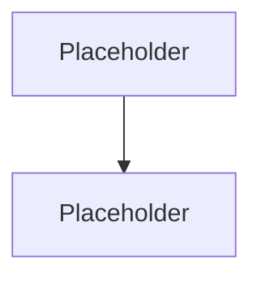

# Diagram Stub Queue

## Audio Scene Object schema defined and validated

## Define proposal schema (canonical JSON schema + versioning strategy)

## Unit: proposal schema validation (happy + failure modes)

## Schema migrations for events, knowledge states, promises

## User accounts, entitlements, playback positions schema

