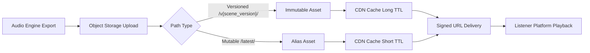

# Audio Storage Conventions (Data Layer)

## Purpose
Define storage paths, metadata, CDN delivery, and cache rules for audio assets independent of audio scene generation. These conventions are the contract between the Audio Engine and the Data Layer.

## Object Storage Path Template

**Immutable, versioned assets (preferred):**
```
/audio/{series_id}/season-{season_number}/episode-{episode_number}/scene-{scene_id}/v{scene_version}/{asset_type}/{filename}
```

**Example:**
```
/audio/uss/season-1/episode-4/scene-ch4-s3/v3/master/scene-ch4-s3.v3.master.flac
```

**Mutable aliases (cache-short):**
```
/audio/{series_id}/season-{season_number}/episode-{episode_number}/scene-{scene_id}/latest/{asset_type}/{filename}
```

### Path Variables
- `series_id`: Short ID for the universe/series (e.g., `uss`).
- `season_number`: Integer season index (1-based).
- `episode_number`: Integer episode index (1-based).
- `scene_id`: Audio Engine scene identifier (stable, unique).
- `scene_version`: Version tag emitted by Audio Engine (monotonic, semantic, or hash).
- `asset_type`: `master`, `stream`, `preview`, `stems`, or `transcript`.
- `filename`: Must include codec and version in the filename for human clarity.

## Required Metadata (Object Headers)
These keys must be written at upload time and are required for all audio assets.

| Key | Type | Description |
| --- | --- | --- |
| `naos-series-id` | string | Series identifier (matches `series_id`). |
| `naos-season-number` | int | Season index (1-based). |
| `naos-episode-number` | int | Episode index (1-based). |
| `naos-scene-id` | string | Audio Engine scene identifier. |
| `naos-scene-version` | string | Audio Engine version tag for the scene. |
| `naos-asset-type` | string | `master`, `stream`, `preview`, `stems`, `transcript`. |
| `naos-codec` | string | Codec name (e.g., `flac`, `aac`, `mp3`). |
| `naos-duration-seconds` | int | Duration in seconds (rounded). |
| `naos-bitrate-kbps` | int | Average bitrate in kbps. |
| `naos-sample-rate-hz` | int | Sample rate in Hz. |
| `naos-provenance-source` | string | Origin system (`audio-engine`, `manual`, `import`). |
| `naos-provenance-pipeline` | string | Pipeline identifier (e.g., `naos-audio-v1`). |
| `naos-provenance-model` | string | Model/voice system used (if applicable). |
| `naos-provenance-input` | string | Input asset or scene object ID. |
| `naos-provenance-commit` | string | Source control commit or build ID. |
| `naos-checksum-sha256` | string | SHA-256 checksum of the file payload. |
| `naos-content-size-bytes` | int | File size in bytes. |

### Optional Metadata
| Key | Type | Description |
| --- | --- | --- |
| `naos-language` | string | BCP-47 language tag (e.g., `en-US`). |
| `naos-loudness-lufs` | float | Integrated loudness value. |
| `naos-true-peak-db` | float | True peak measurement. |
| `naos-notes` | string | Free-form production notes. |

## Metadata Contracts for Audio Engine Integration
The Audio Engine must output the following for each audio asset upload:
- `scene_id` (stable identifier)
- `scene_version` (version tag)
- `asset_type`
- `codec`, `duration_seconds`, `bitrate_kbps`, `sample_rate_hz`
- `provenance` object: `source`, `pipeline`, `model`, `input`, `commit`

## CDN Distribution & Cache Strategy

### Cache-Control Rules
- **Versioned paths (`/v{scene_version}/`)**: immutable, long-lived.
  - `Cache-Control: public, max-age=31536000, immutable`
- **Mutable aliases (`/latest/`)**: short TTL.
  - `Cache-Control: public, max-age=3600, must-revalidate`
- **Signed URLs**: TTL should not exceed CDN edge TTL for mutable aliases.

### Cache Busting
- Always upload new versions to a new `v{scene_version}` path.
- Update any `latest/` aliases to reference the newest version.
- Avoid overwriting immutable paths; treat them as write-once.

### Cache Invalidation Procedures
1. Upload new version to a new `v{scene_version}` path.
2. Update `latest/` alias (re-upload or pointer update).
3. Purge CDN cache for the affected `latest/` path.
4. Document invalidation in publish log (scene id, version, timestamp).

## Signed URL Expiry Guidance
- **Default expiry**: 15 minutes for streaming assets.
- **Maximum expiry**: 1 hour.
- Signed URLs must be invalidated after expiry; access must return HTTP 403/401.

## Storage Durability & Consistency
- Masters are immutable once published.
- Derived assets (`stream`, `preview`) may be regenerated but must advance `scene_version`.
- Metadata is mandatory and treated as a contract for downstream systems.

## Storage → CDN Delivery Flow

