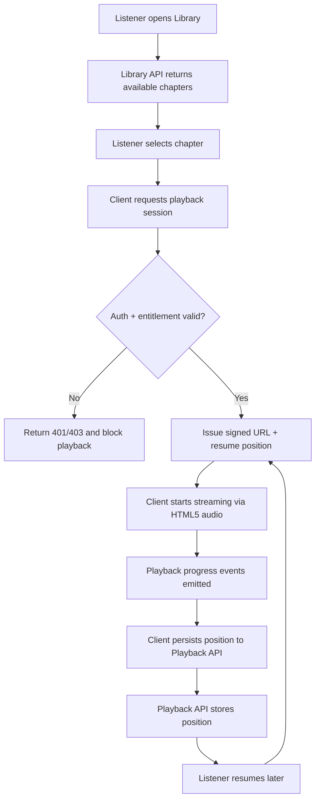

# Audio Streaming Access Flow

> **Scope:** Listener Platform (Authenticated Experience)
> **Last Updated:** 2026-01-20

This flow documents how a signed URL is issued, how playback resumes, and how listening progress is persisted.

## Playback Session Contract

**Inputs**
- `chapter_id`
- `listener_id` (from session)

**Outputs**
- `signed_url` (time-limited, chapter-scoped)
- `resume_position_ms`
- `expires_at`

## Playback Persistence Notes

- Persist position on a cadence (e.g., every 15s) and on stop/pause events.
- Store `position_ms`, `duration_ms`, and `updated_at` per listener + chapter.
- Resume from the last stored position unless the listener explicitly restarts.

## Test Coverage Expectations

- **Unit:** Signed URL generation validates `chapter_id`, entitlement, and expiry bounds.
- **Integration:** Playback position save + restore across sessions.
- **E2E:** Play → pause → resume → reload session and continue playback.
