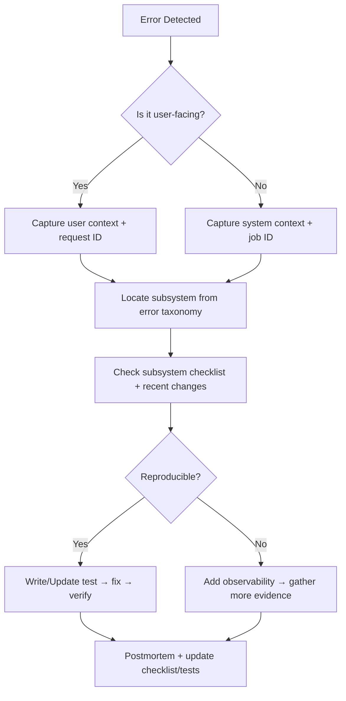

# Incident Response Flow

```mermaid
flowchart TD
  A[Error Detected] --> B{Is it user-facing?}
  B -- Yes --> C[Capture user context + request ID]
  B -- No --> D[Capture system context + job ID]
  C --> E[Locate subsystem from error taxonomy]
  D --> E
  E --> F[Check subsystem checklist + recent changes]
  F --> G{Reproducible?}
  G -- Yes --> H[Write/Update test → fix → verify]
  G -- No --> I[Add observability → gather more evidence]
  H --> J[Postmortem + update checklist/tests]
  I --> J
```

## Related References

- System-wide TODO hub: [SYSTEM_TODO.md](../SYSTEM_TODO.md)
- Error taxonomy and ownership: [docs/error_taxonomy.md](./error_taxonomy.md)
