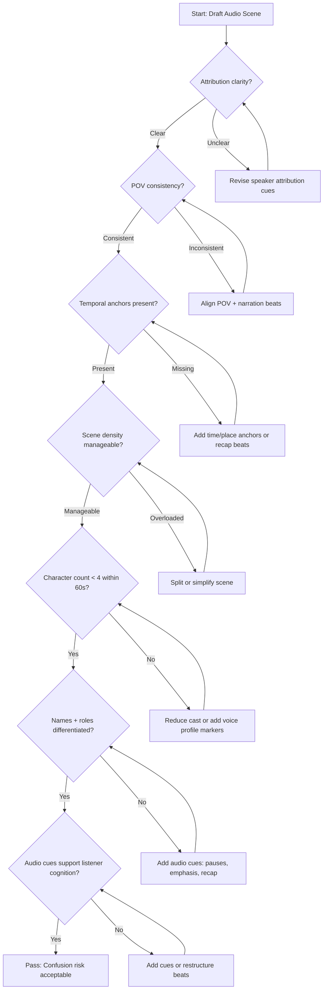

# Listener Confusion Audit Decision Tree

> **Purpose:** Provide a consistent, audio-first decision path for diagnosing listener confusion risks before an audio scene is released.

## Usage Notes

- Run this audit before recording packet generation.
- If any branch loops more than twice, split the scene or re-outline the beat order.
- Record each failure point in the audit log with the scene ID and remediation summary.
