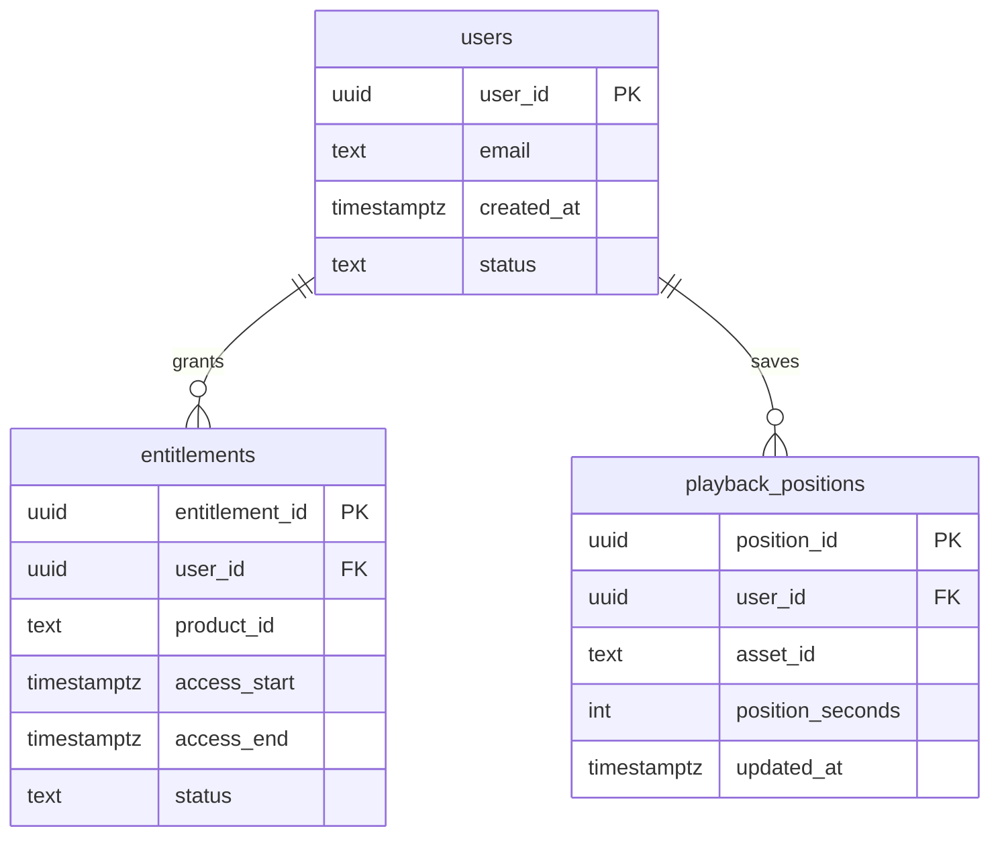

# Listener Schema ERD

## Purpose
Provide an ERD for the listener database, including users, entitlements, and playback state.

## Scope
- Listener accounts and authentication linkage.
- Entitlements and access windows.
- Playback position tracking.

## Entities (Summary)
- `users`
- `entitlements`
- `playback_positions`

## ERD

## Relationship Notes
- A user can have multiple entitlements.
- Playback positions are scoped to `user_id` + `asset_id`.

## Update Triggers
- Listener schema changes.
- Entitlement logic changes.
- Playback position retention policy updates.

## Related Docs
- [docs/listener_db_documentation.md](./listener_db_documentation.md)
- [docs/payments_entitlements.md](./payments_entitlements.md)
