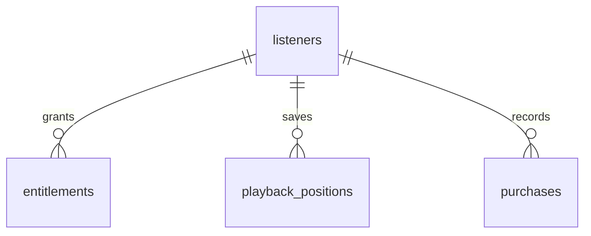

# Listener Schema ERD (Draft)

## Purpose
Provide an ERD for the listener database, including users, entitlements, and playback state.

## Scope
- Listener accounts and authentication linkage.
- Entitlements and purchase receipts.
- Playback position tracking.

## Entities (Outline)
- `listeners`
- `entitlements`
- `playback_positions`
- `purchases`

## Relationship Notes
- Listener has many entitlements.
- Playback positions are scoped to listener + chapter.

## ERD (Placeholder)

## Open Questions
- Do we require a separate purchases table in Phase 1?
- What retention rules apply to playback positions?

## Update Triggers
- Listener schema changes.
- Entitlement logic changes.

## Related Docs
- docs/listener_db_documentation.md
- docs/payments_entitlements.md
