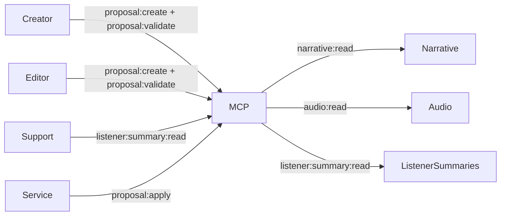

# MCP Permissions Scope Map

## Purpose
Define the permission scopes for MCP resources and tools, mapping roles to allowed actions.

## Scope
- Resource access (read-only narrative/audio/listener summaries).
- Tool access (proposal creation only).
- Model role constraints (Opus/Sonnet/Haiku).

## Roles
- **Creator**: Full read access + proposal creation and validation.
- **Editor/Reviewer**: Read access + proposal creation and validation (no apply).
- **Listener Support**: Read access to listener summaries (no PII).
- **Automation/Service**: Controlled proposal workflows + limited apply access.

## Resource Scopes
- `narrative:read` → Canon and draft narrative state summaries.
- `audio:read` → Audio scene objects, voice profiles, and packet summaries.
- `listener:summary:read` → Aggregated listener status (no PII).

## Tool Scopes
- `proposal:create` → Create proposals only (no canon writes).
- `proposal:validate` → Run validation pipeline and produce reports.
- `proposal:apply` → Apply approved proposals (service-only).

## Access Matrix
| Role | narrative:read | audio:read | listener:summary:read | proposal:create | proposal:validate | proposal:apply |
|------|----------------|-----------|------------------------|-----------------|-------------------|----------------|
| Creator | ✅ | ✅ | ✅ | ✅ | ✅ | ❌ |
| Editor/Reviewer | ✅ | ✅ | ❌ | ✅ | ✅ | ❌ |
| Listener Support | ❌ | ❌ | ✅ | ❌ | ❌ | ❌ |
| Automation/Service | ✅ | ✅ | ✅ | ✅ | ✅ | ✅ |

## Model Registry Scope Mapping (Phase 1)
| Model | Allowed Scopes | Notes |
|-------|----------------|-------|
| Opus | narrative:read, audio:read, proposal:validate | Deep reasoning for continuity checks. |
| Sonnet | narrative:read, audio:read, proposal:create | Drafting and proposal assembly. |
| Haiku | narrative:read | Quick lookups and summaries only. |

## Diagram

## Acceptance Criteria
- Scope names and access matrix are explicit.
- Phase 1 model scope mapping is documented.
- Diagram shows role-to-scope relationships.

## Update Triggers
- New resources or tools.
- Role definitions or permissions changes.

## Related Docs
- docs/mcp_service_contracts.md
- docs/proposal_schema_v1.md
