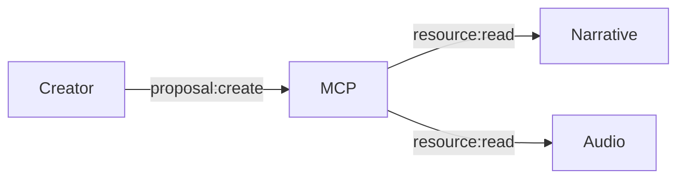

# MCP Permissions Scope Map (Draft)

## Purpose
Define the permission scopes for MCP resources and tools, mapping roles to allowed actions.

## Scope
- Resource access (read-only narrative/audio/listener summaries).
- Tool access (proposal creation only).
- Model role constraints (Opus/Sonnet/Haiku).

## Roles (Outline)
- **Creator**: Full proposal creation, read access to narrative state.
- **Editor/Reviewer**: Read-only access, validation tools.
- **Listener Support**: Read access to listener summaries (no PII).
- **Automation/Service**: Limited scope to specific workflows.

## Resource Scopes (Placeholder)
- `narrative:read`
- `audio:read`
- `listener:summary:read`

## Tool Scopes (Placeholder)
- `proposal:create`
- `proposal:validate`
- `proposal:apply` (service-only)

## Access Matrix (Placeholder)
| Role | narrative:read | audio:read | listener:summary:read | proposal:create | proposal:validate | proposal:apply |
|------|----------------|-----------|------------------------|-----------------|-------------------|----------------|
| Creator | ✅ | ✅ | ✅ | ✅ | ✅ | ❌ |
| Editor | ✅ | ✅ | ❌ | ✅ | ✅ | ❌ |
| Support | ❌ | ❌ | ✅ | ❌ | ❌ | ❌ |
| Service | ✅ | ✅ | ✅ | ✅ | ✅ | ✅ |

## Diagram (Placeholder)

## Open Questions
- Which roles are required for Phase 1?
- What is the initial model registry scope mapping?

## Update Triggers
- New resources or tools.
- Role definitions or permissions changes.

## Related Docs
- docs/mcp_service_contracts.md
- docs/proposal_schema_v1.md
