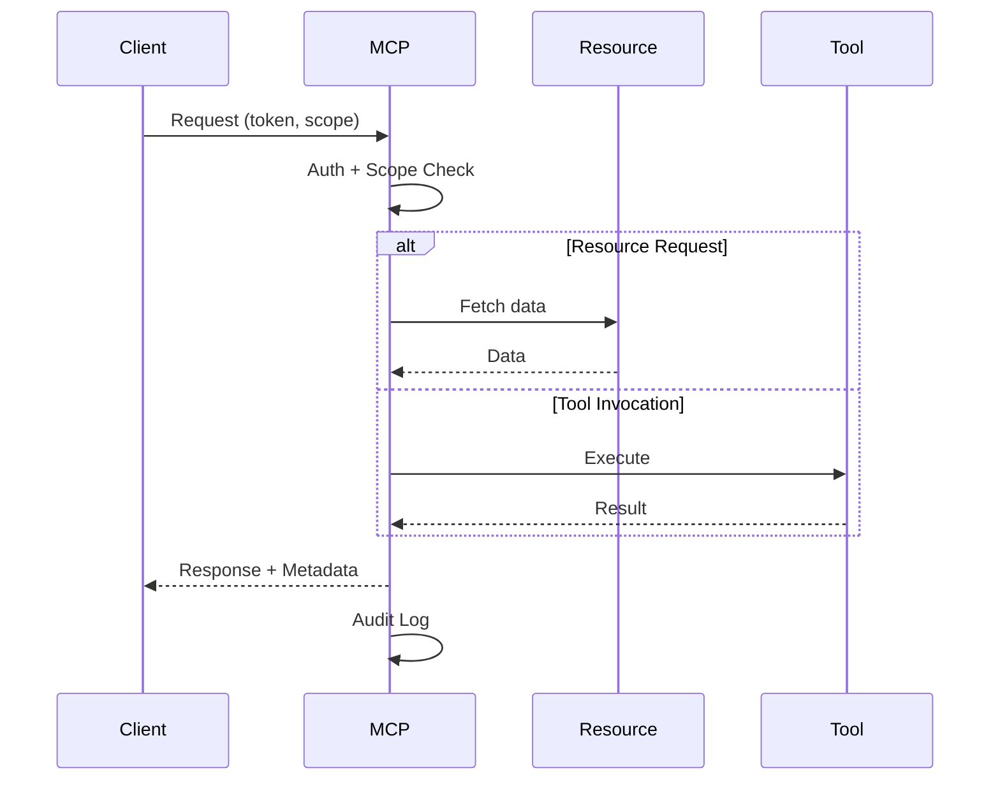

# MCP Request Lifecycle Sequence (Draft)

## Purpose
Document the sequence of an MCP request, from authentication through resource/tool handling and response metadata.

## Scope
- Request authentication and scope checks.
- Resource resolution and tool execution.
- Response metadata and audit logging.

## Sequence Outline
1. **Client Request**
   - Includes auth token and requested scope.
2. **Authentication**
   - Validate token and role.
3. **Scope Authorization**
   - Check allowed resources/tools.
4. **Execution**
   - Resource fetch or tool invocation.
5. **Response**
   - Deterministic metadata (proposal_id, status).
6. **Audit Log**
   - Persist request and outcome.

## Sequence Diagram (Placeholder)

## Open Questions
- What is the canonical response metadata schema?
- Where do trace IDs originate?

## Update Triggers
- Auth system changes.
- Resource/tool contract changes.

## Related Docs
- docs/mcp_service_contracts.md
- docs/error_taxonomy.md
