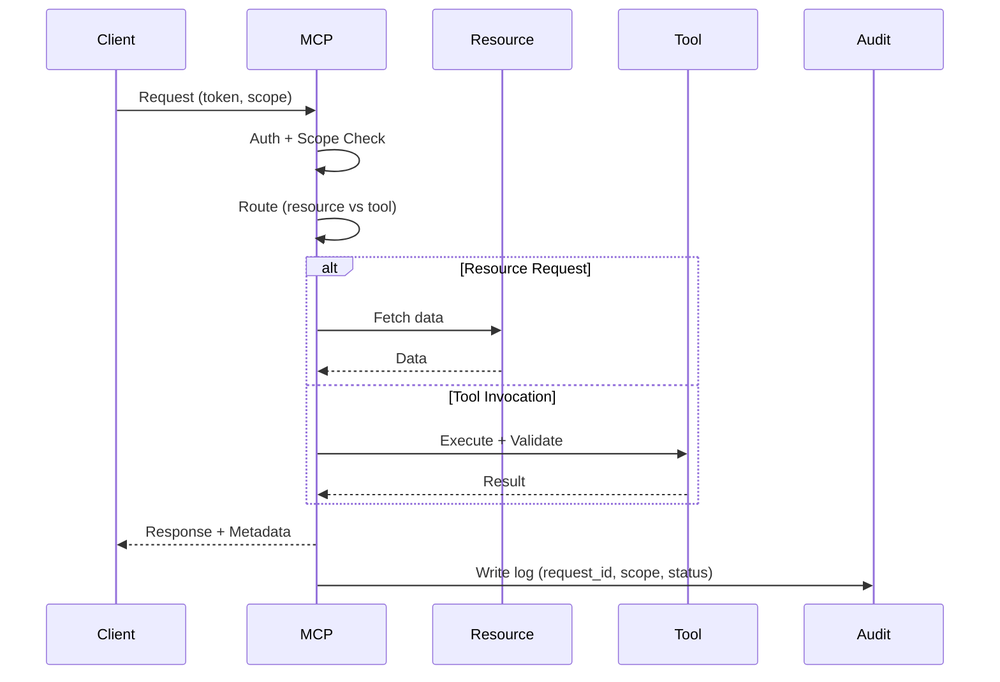

# MCP Request Lifecycle Sequence

## Purpose
Document the sequence of an MCP request, from authentication through resource/tool handling and response metadata.

## Scope
- Request authentication and scope checks.
- Resource resolution and tool execution.
- Response metadata and audit logging.

## Sequence Outline
1. **Client Request**
   - Includes auth token and requested scope.
2. **Authentication**
   - Validate token and role.
3. **Scope Authorization**
   - Check allowed resources/tools.
4. **Routing**
   - Determine resource resolution or tool execution path.
5. **Execution**
   - Resource fetch or tool invocation with validation.
6. **Response**
   - Deterministic metadata (request_id, proposal_id, status).
7. **Audit Log**
   - Persist request, scopes, and outcome.

## Sequence Diagram

## Response Metadata (Phase 1)
- `request_id` (UUID)
- `status` (`ok` | `error`)
- `scope` (resolved scope list)
- `proposal_id` (only for proposal tools)
- `trace_id` (if provided by gateway)

## Update Triggers
- Auth system changes.
- Resource/tool contract changes.

## Related Docs
- docs/mcp_service_contracts.md
- docs/error_taxonomy.md

## Acceptance Criteria
- Sequence includes routing and audit log write.
- Response metadata list is explicit.
