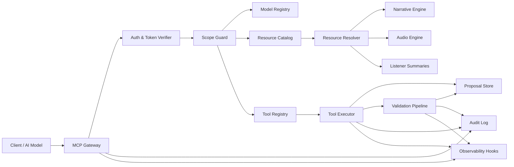

# MCP Spine Architecture Block Diagram

## Purpose
Provide a high-level block diagram of MCP Spine components, data flow, and trust boundaries.

## Scope
- MCP gateway, resource catalog, tool registry, proposal store.
- Auth, scope enforcement, and model registry routing.
- Integration points with Narrative Engine, Audio Engine, and Listener summaries.

## Components
- **MCP Gateway**: Entry point for all MCP requests; validates request shape and routes by type.
- **Auth & Token Verifier**: Validates service tokens and short-lived session tokens.
- **Scope Guard**: Enforces role → scope map and applies per-model permissions.
- **Model Registry**: Maps model identifiers to permitted scopes and rate limits.
- **Resource Catalog**: Index of readable resources (events, canon, knowledge, audio summaries).
- **Resource Resolver**: Read-only access layer with access guards and redaction.
- **Tool Registry**: Whitelisted tools (proposal-only tools, no direct canon writes).
- **Tool Executor**: Executes tools and emits deterministic metadata.
- **Proposal Store**: Draft → submitted → validated → applied → archived lifecycle records.
- **Validation Pipeline**: Canon gate checks (continuity, DAG, promise integrity).
- **Audit Log**: Immutable trail for requests, proposals, and validation results.
- **Observability Hooks**: Trace IDs, structured logs, and metrics.

## Block Diagram

## Data Flow Notes
- Resource access is read-only; all mutations are proposals.
- Scope Guard applies per-model limits before resource or tool access.
- Validation Pipeline blocks apply when canon gates fail.
- Audit Log captures request metadata, proposal state transitions, and validation reports.

## Update Triggers
- MCP service boundary changes.
- New resources or tools added.
- Updates to auth, scope map, or model routing.

## Related Docs
- docs/mcp_service_contracts.md
- docs/proposal_schema_v1.md
- docs/error_taxonomy.md
