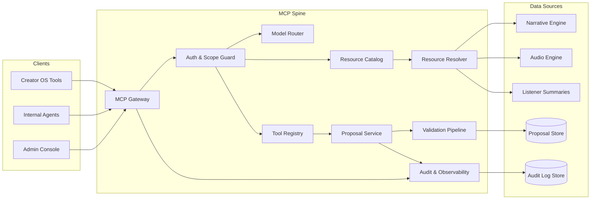

# MCP Spine Architecture Block Diagram

## Purpose
Provide a high-level block diagram of MCP Spine components, with clear trust boundaries and data flows.

## Scope
- MCP gateway, resource catalog, tool registry, proposal lifecycle, audit logging.
- Auth, scope enforcement, and model routing.
- Integration points with Narrative Engine, Audio Engine, and Listener summaries.

## Component Summary
- **MCP Gateway**: Entry point for MCP client requests; validates request envelope and routes by intent.
- **Auth & Scope Guard**: Verifies access token, model role, and resource/tool scopes.
- **Model Router**: Selects model tier (Opus/Sonnet/Haiku) based on scope and request class.
- **Resource Catalog**: Registry of readable resources (events, canon snapshots, knowledge state, audio scene index, listener summaries).
- **Resource Resolver**: Reads data from backing systems with read-only adapters.
- **Tool Registry**: Catalog of proposal-only tools and response templates.
- **Proposal Service**: Proposal lifecycle manager (draft → submitted → validated → applied → archived).
- **Validation Pipeline**: Canon gate checks, dependency DAG checks, continuity rules.
- **Audit & Observability**: Structured logs, trace IDs, proposal audit trail.

## Block Diagram

## Data Flow Notes
1. **Read-only requests**: Gateway → Auth/Scope → Resource Catalog → Resource Resolver → Data Layer.
2. **Proposal requests**: Gateway → Auth/Scope → Tool Registry → Proposal Service → Validation Pipeline → Proposal Store.
3. **Audit coverage**: Every request emits structured logs and trace IDs; proposal transitions emit audit events.

## Update Triggers
- New resources or tools added.
- Scope model changes or routing policy updates.
- Proposal lifecycle changes.

## Related Docs
- [docs/mcp_service_contracts.md](./mcp_service_contracts.md)
- [docs/proposal_schema_v1.md](./proposal_schema_v1.md)
- [docs/error_taxonomy.md](./error_taxonomy.md)
