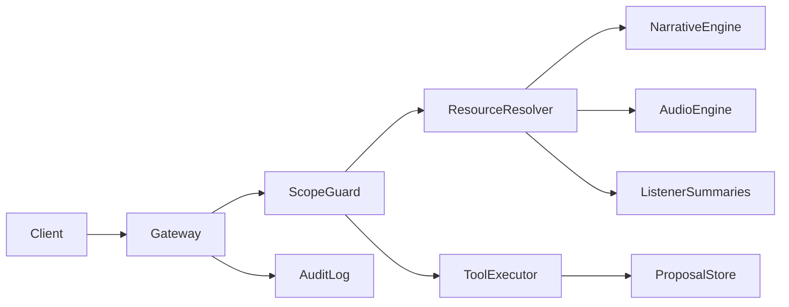

# MCP Spine Architecture Block Diagram (Draft)

## Purpose
Provide a high-level block diagram of MCP Spine components and their interactions.

## Scope
- MCP gateway, resource catalog, tool registry, proposal store.
- Auth and scope enforcement.
- Integration points with Narrative Engine, Audio Engine, Listener summaries.

## Components (Outline)
- **MCP Gateway**: Request routing and auth.
- **Scope Guard**: Role and scope validation.
- **Resource Resolver**: Read-only access to canonical state.
- **Tool Executor**: Proposal creation/validation tools.
- **Proposal Store**: Draft → submitted → validated → applied.
- **Audit Log**: Immutable request and action trail.

## Block Diagram (Placeholder)

## Open Questions
- Where does model routing live (gateway vs tool executor)?
- What is the initial resource catalog MVP?

## Update Triggers
- MCP service boundary changes.
- New resources or tools added.

## Related Docs
- docs/mcp_service_contracts.md
- docs/proposal_schema_v1.md
