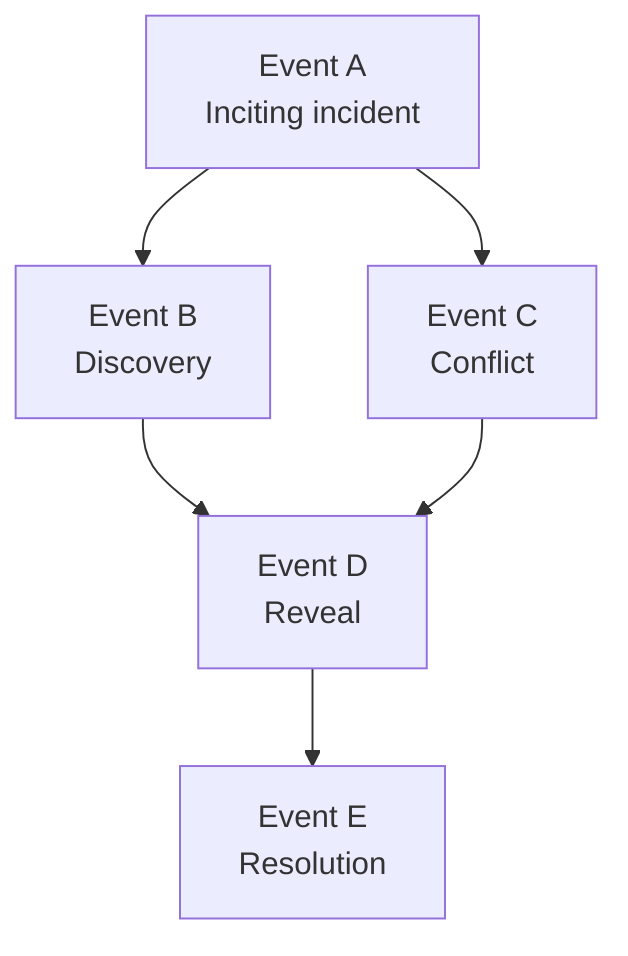

# Narrative Engine Diagrams

## Event Dependency DAG Example



## Canon Gate Decision Flow

```mermaid
flowchart TD
  start([Draft/Proposed Change])
  continuity[Continuity Check\n(DAG + timestamps)]
  knowledge[Knowledge Timing Check]
  promises[Promise Lifecycle Check]
  cognition[Listener Cognition Check]
  pass([Canonize Change])
  fail([Reject + Return Issues])

  start --> continuity
  continuity -->|issues| fail
  continuity --> knowledge
  knowledge -->|issues| fail
  knowledge --> promises
  promises -->|issues| fail
  promises --> cognition
  cognition -->|issues| fail
  cognition -->|clean| pass
```
