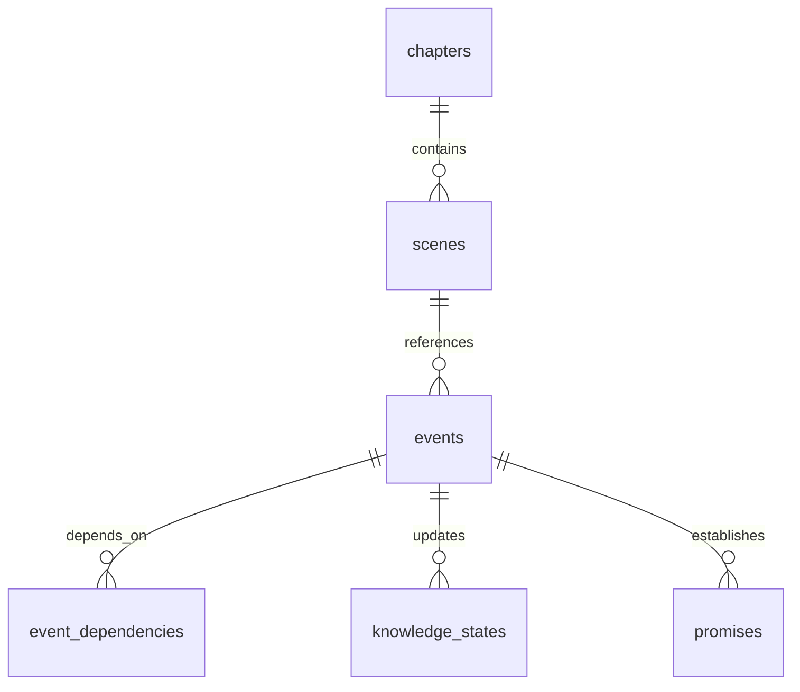

# Narrative Schema ERD (Draft)

## Purpose
Provide an ERD for the narrative database, showing entities, relationships, and canon/draft constraints.

## Scope
- Events, knowledge states, promises, timelines.
- Canon vs draft separation.

## Entities (Outline)
- `events`
- `knowledge_states`
- `promises`
- `event_dependencies`
- `chapters` / `scenes`

## Relationship Notes
- Events are immutable once canon.
- Dependencies form a DAG.
- Promises link to events and scenes.

## ERD (Placeholder)

## Open Questions
- Which tables are Phase 1 required vs Phase 2?
- Do we model explicit canon/draft tables or state flags?

## Update Triggers
- Narrative schema changes.
- Canon enforcement rule updates.

## Related Docs
- docs/narrative_db_documentation.md
- docs/canon_draft_enforcement.md
- docs/narrative_db_schema.sql
