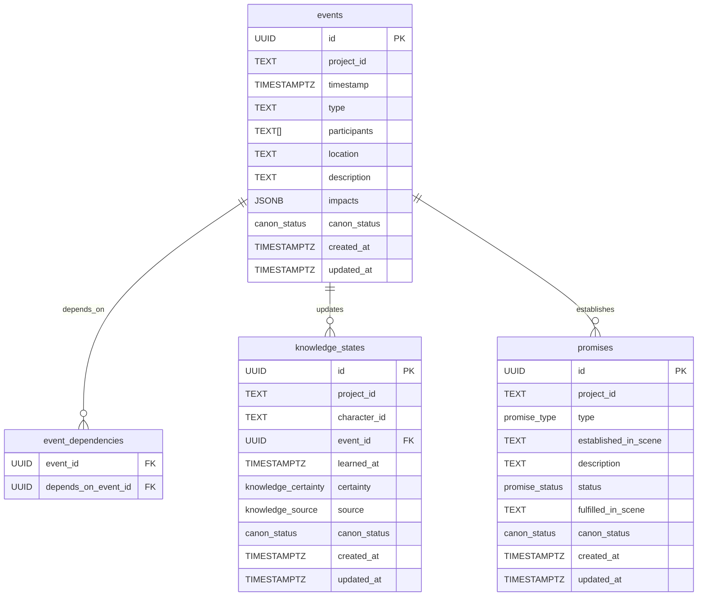

# Narrative Schema ERD

## Purpose
Provide an ERD for the narrative database, showing entities, relationships, and canon/draft constraints.

## Scope
- Events, knowledge states, promises, timelines.
- Canon vs draft separation.

## Entities
- `events`
- `event_dependencies`
- `knowledge_states`
- `promises`

## Relationship Notes
- Events are immutable once `canon_status = canon`.
- Dependencies form a DAG via `event_dependencies`.
- Knowledge states are anchored to events that established them.
- Promises are linked to the scene identifier where they are established.

## ERD

## Canon/Draft Constraints
- `canon_status` is enforced on `events`, `knowledge_states`, and `promises`.
- Canon rows are immutable; updates are only allowed for `draft` or `proposed`.

## Update Triggers
- Narrative schema changes.
- Canon enforcement rule updates.

## Related Docs
- docs/narrative_db_documentation.md
- docs/canon_draft_enforcement.md
- docs/narrative_db_schema.sql
