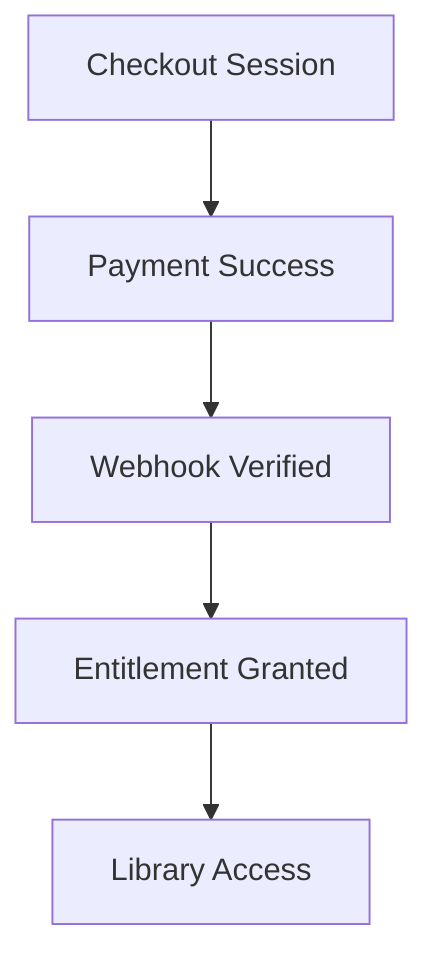

# Payment → Entitlement Flow (Draft)

## Purpose
Describe how payments translate into listener entitlements, including Stripe events, verification, and entitlement persistence.

## Scope
- Stripe Checkout and webhook processing.
- Entitlement creation and validation.
- Listener access gating after purchase.

## Systems Covered
- Payments & Entitlements
- Listener Platform (Auth + Library access)
- Listener DB

## Flow Outline
1. **Checkout Session Created**
   - Price and product selection.
2. **Payment Completed**
   - Stripe payment intent succeeds.
3. **Webhook Verification**
   - Signature verification and idempotency.
4. **Entitlement Grant**
   - Persist entitlement record in listener DB.
5. **Access Granted**
   - Authenticated user can access library and playback.

## Data & State Requirements
- Stripe event IDs and idempotency keys.
- Entitlement status and timestamps.
- Listener account linkage.

## Failure & Recovery Paths
- Webhook failures (retry strategy).
- Partial payments or abandoned checkout.
- Access denied flow when entitlement missing/expired.

## Flowchart (Placeholder)

## Open Questions
- Which Stripe events are the authoritative source of truth?
- How do we handle refunds and entitlement revocation?

## Update Triggers
- Stripe webhook changes.
- Entitlement rules or pricing changes.

## Related Docs
- docs/payments_entitlements.md
- docs/marketing_onboarding.md
- docs/ui_mvp_documentation.md
