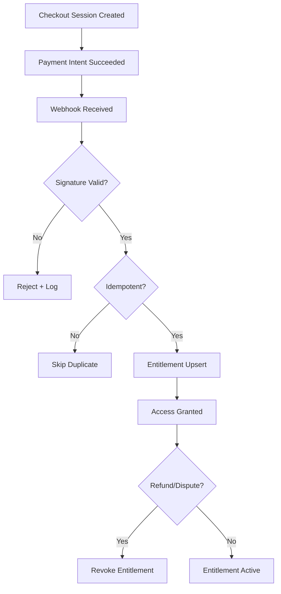

# Payment → Entitlement Flow

## Purpose
Describe how payments translate into listener entitlements, including Stripe events, verification, and entitlement persistence.

## Scope
- Stripe Checkout and webhook processing.
- Entitlement creation and validation.
- Listener access gating after purchase.

## Systems Covered
- Payments & Entitlements
- Listener Platform (Auth + Library access)
- Listener DB

## Flow Outline
1. **Checkout Session Created**
   - Price, product, and customer metadata captured.
2. **Payment Completed**
   - Stripe payment intent succeeds.
3. **Webhook Verification**
   - Signature verification and idempotency key check.
4. **Entitlement Grant**
   - Persist entitlement record in listener DB with `active` status.
5. **Access Granted**
   - Authenticated user can access library and playback.
6. **Lifecycle Updates**
   - Refunds or disputes trigger entitlement revocation or suspension.

## Data & State Requirements
- Stripe event IDs, checkout session ID, payment intent ID.
- Idempotency keys for webhook processing.
- Entitlement status (`active`, `revoked`, `expired`) and timestamps.
- Listener account linkage via customer email/user ID.

## Failure & Recovery Paths
- Webhook failures (retry strategy and alerting on repeated failures).
- Abandoned checkout → follow-up email with resume link.
- Access denied flow when entitlement missing/expired.
- Refund or chargeback triggers entitlement revocation and notification.

## Flowchart

## Stripe Events (Authoritative)
- `checkout.session.completed` → primary entitlement grant trigger.
- `payment_intent.succeeded` → verification support signal.
- `charge.refunded` and `charge.dispute.created` → revocation trigger.

## Update Triggers
- Stripe webhook changes.
- Entitlement rules or pricing changes.

## Related Docs
- docs/payments_entitlements.md
- docs/marketing_onboarding.md
- docs/ui_mvp_documentation.md
