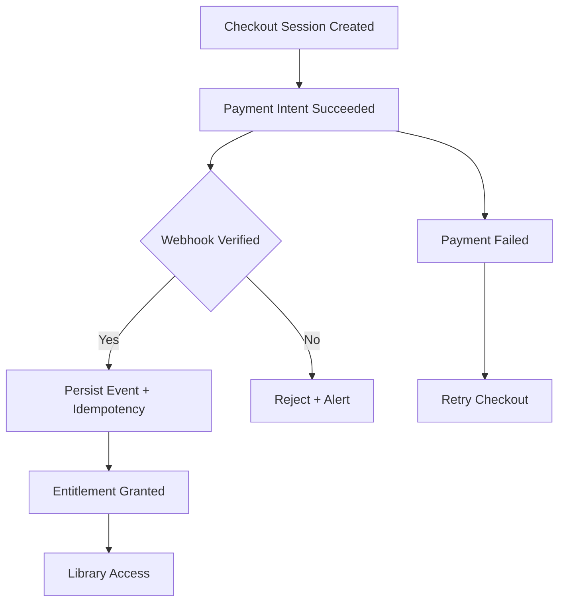

# Payment → Entitlement Flow

## Purpose
Describe how payments translate into listener entitlements, including Stripe events, verification, and entitlement persistence.

## Scope
- Stripe Checkout and webhook processing.
- Entitlement creation and validation.
- Listener access gating after purchase.

## Systems Covered
- Payments & Entitlements
- Listener Platform (Auth + Library access)
- Listener DB

## Flow Outline
1. **Checkout Session Created**
   - Price and product selection; metadata attaches user ID.
2. **Payment Completed**
   - Stripe payment intent succeeds.
3. **Webhook Verification**
   - Signature verification, idempotency checks, and event persistence.
4. **Entitlement Grant**
   - Entitlement record written with status and timestamps.
5. **Access Granted**
   - Authenticated user can access library and playback.

## Data & State Requirements
- Stripe event IDs and idempotency keys stored with webhook payload hash.
- Entitlement status (`active`, `revoked`, `pending_refund`) and timestamps.
- Listener account linkage (user ID and email).

## Failure & Recovery Paths
- **Webhook failures**: Retry via Stripe webhook retries; alert on repeated failures.
- **Partial payments**: Mark entitlement as `pending_review` and block access.
- **Refunds / chargebacks**: Set entitlement to `revoked` and log audit reason.
- **Duplicate events**: Idempotency key prevents double grants.

## Flowchart

## Update Triggers
- Stripe webhook changes.
- Entitlement rules or pricing changes.
- Refund/chargeback policy updates.

## Related Docs
- docs/payments_entitlements.md
- docs/marketing_onboarding.md
- docs/ui_mvp_documentation.md
