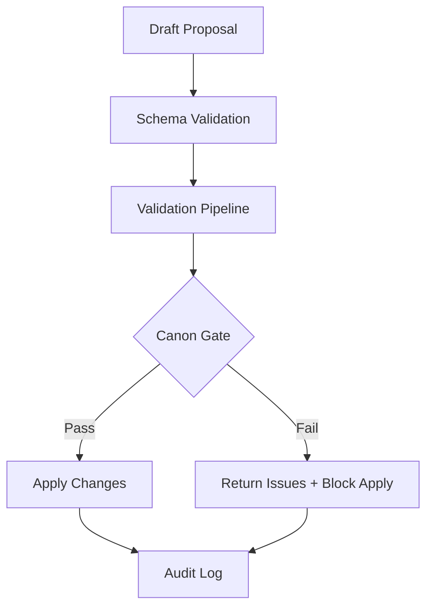

# Proposal-Based Modification Flow

## Purpose
Describe the end-to-end proposal workflow for canon-affecting changes, from draft creation through validation and apply.

## Scope
- Proposal lifecycle states and required validations.
- Canon gate integration and audit logging.
- Excludes narrative editor UX specifics.

## Systems Covered
- MCP Spine
- Narrative Engine
- Creator OS

## Flow Outline
1. **Draft Proposal**
   - Creator (or tool) submits intent, scope, and changes.
2. **Schema Validation**
   - Validate proposal shape, required fields, and version.
3. **Validation Pipeline**
   - Continuity checks, dependency DAG validation, listener cognition checks.
4. **Canon Gate Review**
   - Promise impact, timeline ordering, canon conflicts.
5. **Decision**
   - Pass → proposal can be applied.
   - Fail → return issues and block apply.
6. **Apply Proposal**
   - Canonization and state updates.
7. **Audit Log**
   - Record proposal, validation reports, and decision outcome.

## Required Inputs
- Proposed changes (event payloads).
- Dependency references.
- Affected knowledge states.

## Outputs
- Canonized event updates.
- Validation report.
- Proposal audit entry.

## Flowchart

## Validation Gates (Phase 1)
- **Blocking:** schema errors, continuity breaks, missing dependencies, canon conflicts.
- **Advisory:** listener cognition warnings, minor clarity issues.

## Acceptance Criteria
- Proposal lifecycle states are explicit in the flow.
- Canon gate pass/fail outcomes are shown.
- Audit logging is shown for both pass/fail outcomes.

## Update Triggers
- Proposal schema changes.
- Canon gate rule updates.

## Related Docs
- docs/proposal_schema_v1.md
- docs/narrative_engine_diagrams.md
- docs/mcp_service_contracts.md
