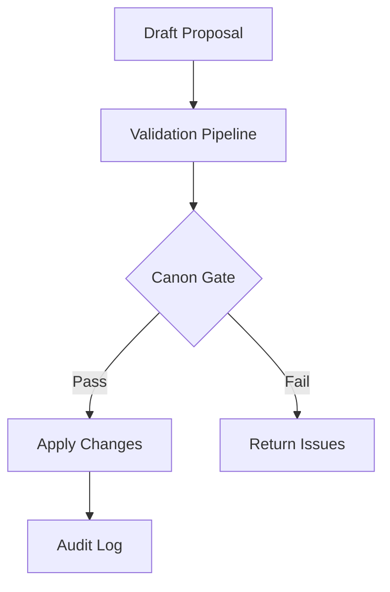

# Proposal-Based Modification Flow (Draft)

## Purpose
Describe the end-to-end proposal workflow for canon-affecting changes, from draft creation through validation and apply.

## Scope
- Proposal lifecycle states and required validations.
- Canon gate integration and audit logging.
- Excludes narrative editor UX specifics.

## Systems Covered
- MCP Spine
- Narrative Engine
- Creator OS

## Flow Outline
1. **Draft Proposal**
   - Creator submits intent and context.
2. **Validate Proposal**
   - Continuity checks, dependency DAG validation.
3. **Canon Gate Review**
   - Conflicts, promises, and timeline ordering.
4. **Apply Proposal**
   - Canonization and state updates.
5. **Audit Log**
   - Record proposal and validation reports.

## Required Inputs
- Proposed changes (event payloads).
- Dependency references.
- Affected knowledge states.

## Outputs
- Canonized event updates.
- Validation report.
- Proposal audit entry.

## Flowchart (Placeholder)

## Open Questions
- What is the minimal proposal schema for Phase 1?
- Which validation rules are blocking vs advisory?

## Update Triggers
- Proposal schema changes.
- Canon gate rule updates.

## Related Docs
- docs/proposal_schema_v1.md
- docs/narrative_engine_diagrams.md
- docs/mcp_service_contracts.md
