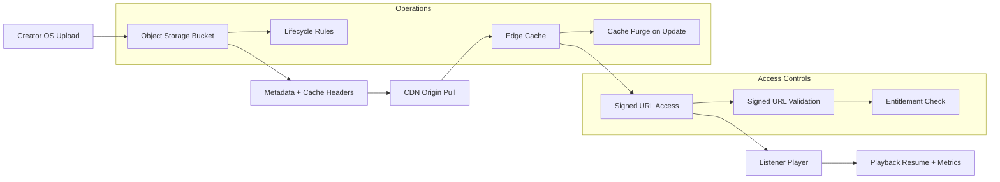

# Storage → CDN Delivery Flow

> **Purpose:** Visualize how audio assets move from object storage through CDN delivery
> so the listener platform can serve signed, cacheable audio streams.

## Notes
- Signed URLs are short-lived and tied to entitlements.
- Cache headers are set at upload time and respected by the CDN.
- Cache purges occur when audio masters are replaced.
