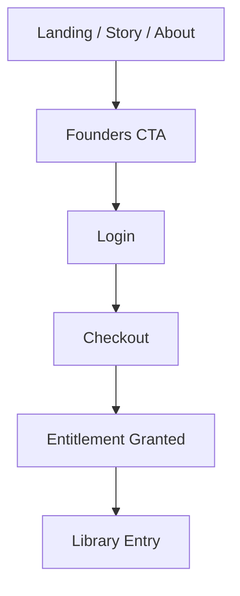

# Visitor Conversion Funnel (Draft)

## Purpose
Document the public marketing funnel from first visit through Founders checkout, including the UI touchpoints, CTA sequencing, and drop-off recovery options.

## Scope
- Public marketing pages and primary CTA flow.
- Email auth entry point and handoff to payment.
- Excludes post-purchase onboarding and library playback.

## Systems Covered
- Listener Platform (Marketing & Onboarding)
- Payments & Entitlements (handoff only)

## Funnel Stages (Outline)
1. **Arrival**
   - Entry points: landing page, story, about.
   - Primary CTA: Founders membership.
2. **Interest**
   - Audio trailer engagement.
   - Story/world summary.
3. **Intent**
   - Founders pricing/benefits view.
   - CTA to checkout.
4. **Authentication**
   - Email-first login required before purchase.
5. **Checkout**
   - Stripe Checkout session.
6. **Post-Purchase Confirmation**
   - Receipt and entitlement confirmation.
   - CTA to Library.

## UI/UX Notes
- CTA hierarchy and consistent placement across pages.
- Copy requirements for Founders value proposition.
- Error handling for failed checkout or auth interruptions.

## Metrics & Events (To Define)
- CTA clicks (by page)
- Trailer play and completion rate
- Login starts/completions
- Checkout starts/completions

## Flowchart (Placeholder)

## Open Questions
- Which page is the primary entry for paid conversion?
- What are the minimum analytics events required for Phase 1?

## Update Triggers
- Changes to public pages or CTA flow.
- Auth or payment changes.

## Related Docs
- docs/marketing_onboarding.md
- docs/ui_mvp_documentation.md
- docs/payments_entitlements.md
