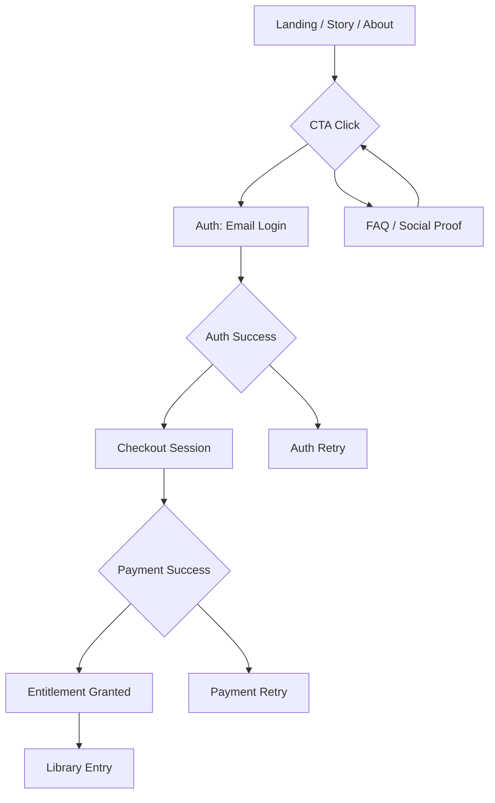

# Visitor Conversion Funnel

## Purpose
Document the public marketing funnel from first visit through Founders checkout, including UI touchpoints, CTA sequencing, and recovery paths.

## Scope
- Public marketing pages and primary CTA flow.
- Email auth entry point and handoff to payment.
- Excludes post-purchase onboarding and library playback.

## Systems Covered
- Listener Platform (Marketing & Onboarding)
- Payments & Entitlements (handoff only)

## Funnel Stages
1. **Arrival**
   - Entry points: landing, story, about, referral links.
   - Primary CTA: “Become a Founder.”
2. **Interest**
   - Audio trailer engagement with inline summary.
   - Social proof and creator credibility callouts.
3. **Intent**
   - Founders pricing/benefits view.
   - Secondary CTA: “Read the FAQ.”
4. **Authentication**
   - Email-first login required before purchase.
   - Capture intent to resume checkout after auth.
5. **Checkout**
   - Stripe Checkout session creation.
   - Terms acknowledgement and price confirmation.
6. **Post-Purchase Confirmation**
   - Receipt, entitlement confirmation, and CTA to Library.

## Recovery Paths
- **Auth Interrupted**: Return user to checkout with preserved price and intent.
- **Checkout Abandoned**: Email reminder with “Resume Checkout” deep link.
- **Payment Failed**: Inline retry with support link.

## Metrics & Events
- CTA clicks (by page)
- Trailer plays, 25/50/75/100% completion
- Login starts/completions
- Checkout starts/completions
- Payment failures and recovery completions

## Flowchart

## Update Triggers
- Changes to public pages, CTA copy, or auth flow.
- Payment or entitlement handoff changes.
- New analytics requirements.

## Related Docs
- docs/marketing_onboarding.md
- docs/ui_mvp_documentation.md
- docs/payments_entitlements.md
