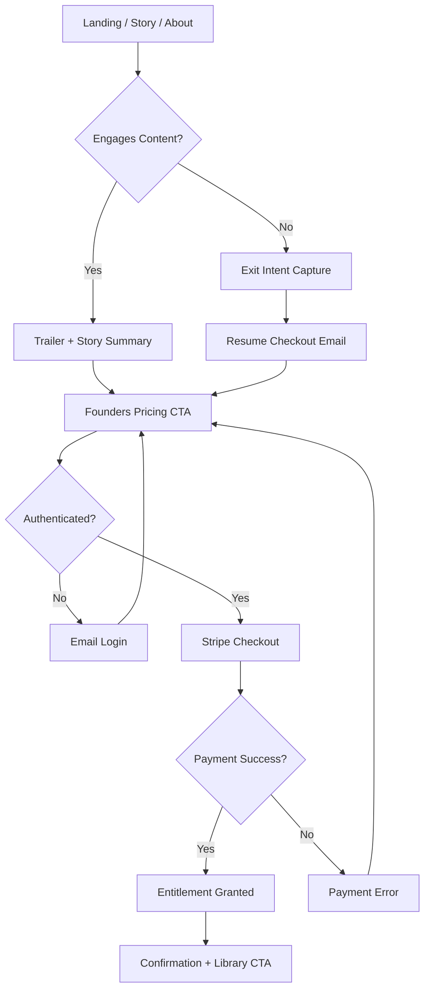

# Visitor Conversion Funnel

## Purpose
Document the public marketing funnel from first visit through Founders checkout, including the UI touchpoints, CTA sequencing, and drop-off recovery options.

## Scope
- Public marketing pages and primary CTA flow.
- Email auth entry point and handoff to payment.
- Excludes post-purchase onboarding and library playback.

## Systems Covered
- Listener Platform (Marketing & Onboarding)
- Payments & Entitlements (handoff only)

## Funnel Stages
1. **Arrival**
   - Entry points: landing page, story, about, or direct campaign URLs.
   - Primary CTA: Founders membership.
2. **Interest**
   - Audio trailer engagement and teaser content.
   - World summary and creator credibility proof points.
3. **Intent**
   - Founders pricing, benefits, and scarcity messaging.
   - CTA to start checkout.
4. **Authentication**
   - Email-first login required before purchase.
   - Lightweight sign-in with magic link and return to checkout.
5. **Checkout**
   - Stripe Checkout session created and redirected.
6. **Post-Purchase Confirmation**
   - Receipt and entitlement confirmation.
   - CTA to Library and onboarding email sequence.

## UI/UX Notes
- CTA hierarchy and consistent placement across pages (hero + sticky CTA).
- Value proposition copy must reinforce limited-time Founders pricing.
- Resumable flow after auth or failed payment.

## Metrics & Events
- CTA clicks by entry page and content section.
- Trailer play and completion rate.
- Login starts/completions and magic link success rate.
- Checkout starts/completions and abandonment rate.
- Entitlement granted confirmation rate.
- Recovery funnel re-engagement (email capture → return to checkout).

## Drop-Off Recovery
- Exit intent capture with a single-field email signup.
- “Resume checkout” email with deep link to pricing.
- Error state guidance for failed auth or payment.

## Flowchart

## Assumptions
- The landing page is the primary conversion entry point.
- Email-first login is required before checkout creation.

## Update Triggers
- Changes to public pages or CTA flow.
- Auth or payment changes.

## Related Docs
- docs/marketing_onboarding.md
- docs/ui_mvp_documentation.md
- docs/payments_entitlements.md
